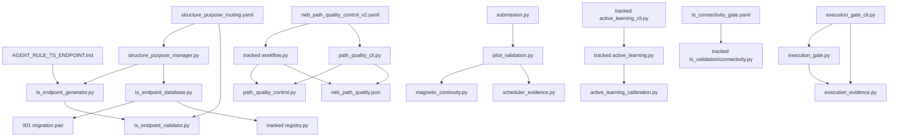

# E Source Architecture

## 范围

既有 E 类实际为 23 项：用户分组列出的 22 项，加
`REFACTOR_CHANGESET.md` 中的 `AGENT_RULE_TS_ENDPOINT.md`。后者作为规则
文档审查，不作为源码。

## 依赖图

E 类内部 AST 依赖图没有强连通分量，未发现循环依赖。

## 权威边界

- `execution_gate.py` 仍是唯一动作授权实现。
- `execution_evidence.py` 只加载、绑定、验证证据并计算授权前提。
- `path_quality_control.py` 产生证据和状态，不授权提交、停止、CI-NEB、
  DIMER 或 TS 接受。
- `pilot_validation.py` 只证明短 pilot 的 scheduler/VASP/path 证据；
  `submission.py` 消费并重新验证它。
- endpoint generator/validator 只选择和验证 endpoint；数据库写入集中在
  `ts_endpoint_database.py`。

没有发现第二个可直接提交、停止任务或批准 TS 的 E 类实现。

## 重复和耦合

### 明确的重复候选

`path_quality_cli.py` 与 tracked `ts_strategy_engine/workflow.py` 都执行：

- 读取 `neb_path_quality_control_v2.yaml`；
- 合并 `default_thresholds.yaml` 的 geometry/electronic 参数；
- 调用 `collect_evidence()` 和 `evaluate_quality()`；
- 写 `neb_path_quality.json`；
- 声明同一个 producer。

统一 TS CLI 已通过 `workflow.py` 提供正式入口；仓库中没有
`path_quality_cli` 的 import、文档命令、subprocess 或历史模块路径。
该文件完整且可通过 `python -m ... --help` 启动，因此是
`DUPLICATE_CANDIDATE`，不是废弃结论。

### 重复状态字符串

- endpoint 的 `VALID`、`VALID_WITH_WARNING`、`REVIEW_REQUIRED`、
  `REJECTED` 同时存在于 Enum、数据库模型和 SQL CHECK；目前值一致，是跨层
  契约重复。
- active-learning 状态字符串分布在 calibration、domain、label 和 Schema
  消费代码；测试锁定流程，但没有单一 Enum。
- path-quality 状态由 evaluator 生成并被 execution gate 消费；字符串语义
  一致，没有第二个判定算法。

### 配置和文件 I/O

- path-quality 配置加载/合并在 CLI 和 workflow 重复。
- endpoint threshold 只由 validator 加载，purpose enable 由 manager 从同一
  配置读取，职责不同。
- JSON 写入主要复用 `artifact_io`；没有固定临时文件实现。
- pilot 把 scheduler 查询、VASP 文件重建、判定和 artifact 写入放在同一
  模块，属于高内聚但非纯业务层。
- active-learning calibration 同时执行规则校验和 state 写入。

## 科学规则与副作用

包含科学/物理/化学判定：

- 三个配置文件；
- endpoint generator/validator；
- magnetic continuity；
- path-quality evaluator；
- pilot validation；
- active-learning calibration；
- execution evidence 中 Grade-A、频率和双向连通性前提。

有持久副作用：

- `StructurePurposeManager` 的 TS 路径最终调用 endpoint database `save()`；
- endpoint migration 和 database adapter 可写 SQLite；
- path-quality CLI/workflow、pilot、active calibration、execution gate CLI
  写 JSON/state。

直接数据库访问集中在 `ts_endpoint_database.py`，没有散布到 generator、
validator 或 CLI。

## 测试真实入口覆盖

- endpoint 四模块：16 个专用测试覆盖 routing、选择、几何/键变化、警告、
  idempotent save 和 migration/rollback。
- path quality：5 个测试只直接覆盖 `evaluate_quality()`；没有直接覆盖
  `collect_evidence()`、独立 CLI 或与 unified workflow 的输出等价性。
- pilot：2 个测试覆盖 build 和 validate，scheduler/live check 被 mock；
  CLI 参数解析没有单独测试。
- magnetic continuity 通过 pilot 测试覆盖。
- execution gate CLI 通过 16 个 file-bound gate 测试覆盖。
- active calibration 由 tracked active-learning 测试覆盖 registration 和
  reuse。
- connectivity config 由 tracked TS validation 流程消费。
- VASP input/result 两个测试直接覆盖 tracked 正式模块。

主要缺口不是“测试副本”，而是 path-quality 两个入口的重复 orchestration
没有等价性测试。
