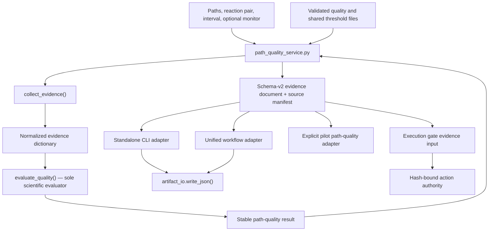

# NEB Path-Quality Architecture

Date: 2026-07-27

## Responsibility chain



## Authoritative components

### Scientific core

`scripts/neb_agent/path_quality_control.py`

- `collect_evidence()` reads NEB image files and returns normalized evidence.
- `evaluate_quality()` is the sole scientific evaluator.
- Its function body, signature, statuses, reason codes, condition order,
  geometry definitions, thresholds, and result fields were not changed.
- It has no argparse, `sys.exit`, JSON write, scheduler, submission, SSH, LSF,
  or execution authority.

### Shared application layer

`scripts/neb_agent/path_quality_service.py`

- owns path-quality configuration loading and validation;
- merges the same two threshold sources used before Phase 2B;
- loads optional monitor evidence;
- invokes the existing collector once and evaluator once;
- constructs the existing Schema-v2 document and source-file manifest;
- returns a dictionary and never writes an output file.

`PathQualityRequest` is a bounded immutable request object. The service does
not contain scheduler, submission, stopping, TS acceptance, endpoint, or
database behavior.

### Adapters

- `path_quality_cli.py` owns argparse, error-to-exit conversion, output-path
  selection, atomic JSON writing, and status printing.
- `workflow.py::_path_quality()` preserves the old no-output and
  missing-primary-coordinate returns, constructs the shared request, writes
  `neb_path_quality.json`, and passes the unchanged report onward.
- `pilot_validation.py::build_pilot_path_quality_result()` is an explicit
  adapter to the same shared report. It does not change the existing pilot
  `passed` decision or Schema-v2 pilot artifact.

### Action authority

`scripts/ts_strategy_engine/execution_gate.py` remains the only NEB action
authority. Path quality is evidence only. No Phase 2B module can submit, stop,
rebuild, approve CI-NEB/DIMER, accept a TS, or promote a barrier.

## Dependency direction

```text
path_quality_cli ─┐
workflow ─────────┼─> path_quality_service ─> path_quality_control
pilot_validation ─┘
```

The five-module AST import graph contains no cycle. The core does not import
the application layer or any adapter. The service does not import workflow,
pilot, CLI, execution gate, scheduler, or submission.

## Persistence boundary

The shared service does not write. CLI and workflow decide whether and where
to persist, and both use `scripts.artifact_io.write_json()`, whose existing
same-directory unique temporary file and atomic replace behavior remains
unchanged. Tests write only to pytest temporary directories.

## Compatibility surface

Preserved without signature changes:

- `scripts.neb_agent.path_quality_control.quality_source_paths`
- `scripts.neb_agent.path_quality_control.collect_evidence`
- `scripts.neb_agent.path_quality_control.evaluate_quality`
- `scripts.neb_agent.path_quality_cli` module path and all CLI arguments
- `scripts.ts_strategy_engine.workflow.AnalyzeRequest`
- `scripts.neb_agent.pilot_validation.build_pilot_result`
- `scripts.neb_agent.pilot_validation.validate_pilot_result`

The document kind, producer, Schema version, output filename, evaluator field
order, reason-code order, and source-manifest construction are preserved.
