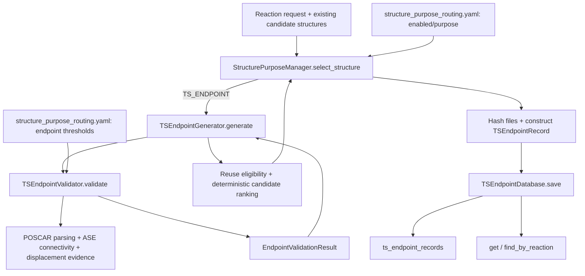

# TS Endpoint Current Architecture

Date: 2026-07-27
Scope: actual current implementation, before any Phase 3B refactor

## Current call chain



There is no repository production/CLI caller of `StructurePurposeManager` yet.
The live call graph is manager → generator → validator and manager → database;
tests and governance documentation are the external consumers.

## Dependency graph

```text
structure_purpose_manager
  ├─ ts_endpoint_generator
  │    └─ ts_endpoint_validator
  └─ ts_endpoint_database

ts_endpoint_validator
  ├─ adsmind_common (YAML/ASE loading)
  ├─ relaxed_analysis (connectivity)
  └─ neb_agent.utils_structure (POSCAR/mapping/displacement)

ts_endpoint_database
  └─ ts_strategy_engine.registry (connection/transaction/schema-v5 check)
```

Static AST inspection found three internal dependency edges and no cycle.

## Responsibility findings

### `ts_endpoint_generator.py`

Current responsibilities:

- validates `endpoint_role`;
- adapts a generation request and candidate metadata into validation requests;
- calls the sole endpoint validator once per candidate;
- applies stable-global-minimum reuse eligibility;
- ranks eligible existing candidates deterministically.

It does not:

- understand a reaction beyond supplied IDs/atoms/bond changes;
- generate coordinates or select adsorption sites geometrically;
- write files;
- persist a record;
- call a scheduler or execution gate.

Finding: the implementation is a bounded selector, but the word “generator”
overstates its responsibility. Renaming is not justified because the public
path is already a compatibility contract.

### `ts_endpoint_validator.py`

Current responsibilities:

- validates configuration Schema and applies threshold overrides;
- reads POSCAR twice through the local parser;
- reads structures again through ASE for connectivity;
- calculates atom/periodic displacement;
- checks atom mapping and index bounds;
- calculates expected/observed bond changes;
- classifies Fe–adsorbate site-coordination bond changes;
- compares caller-provided site-change labels;
- assigns statuses, scores, errors, warnings, and reason ordering;
- formats the result dataclass.

It does not write artifacts or databases and does not authorize execution.

Finding: this is the only endpoint scientific evaluator, but it combines input
loading, evidence calculation, scientific classification, and result
construction. `validate()` is 137 lines; the module is 479 lines. The same
initial structure is parsed through two representations and is loaded a third
time for masses. This is the main Phase 3B responsibility candidate.

### `structure_purpose_manager.py`

Current responsibilities:

- loads the feature switch and resolves explicit/inherited/default purpose;
- delegates stable and legacy routes;
- orchestrates TS selection;
- hashes selected/stable files;
- translates the selected result into a persistence record;
- persists successful TS selection.

It does not:

- calculate bond or site changes;
- reassign validator status/reasons;
- execute migrations;
- generate coordinates.

Finding: the manager is an application orchestrator, not a second scientific
validator. Its record-building helper contains persistence mapping, but this
mapping is coupled to `TSEndpointRecord`. The current order prevents a rejected
candidate from being stored as a successful manager selection.

### `ts_endpoint_database.py`

Current adapter responsibilities:

- validates record-level storage invariants;
- saves idempotently;
- queries by ID/reaction;
- converts JSON and integer booleans;
- relies on the registry connection for commit/rollback.

Additional responsibility in the same module:

- locates, executes, and verifies forward/rollback SQL migration files.

It does not import generator or validator and does not calculate science.

Finding: ordinary adapter methods are clean, but the module mixes repository
access with a blocked migration runner. That separation cannot be implemented
while the migration backlog is blocked.

## Actual scientific ownership

| Decision | Current owner |
|---|---|
| Atom/order/periodic mapping | validator |
| Target/observed bond changes | validator |
| Site-change evidence and Fe coordination explanation | validator |
| Displacement/multi-event warning | validator |
| Validation status, score, reason ordering | validator |
| Stable-product reuse eligibility | generator |
| Candidate priority and energy tie-break | generator |
| Purpose route | manager |
| Record persistence | manager + database adapter |
| Downhill TS connectivity | separate `scripts.ts_validation.connectivity`; not these modules |
| Execution authorization | separate execution gate; not these modules |

## Repetition and coupling

1. No duplicate endpoint evaluator was found.
2. Generator does not repeat connectivity calculations; it consumes validator
   results.
3. Manager does not repeat generator or validator decisions.
4. Database duplicates allowed status strings from the validator Enum; the SQL
   CHECK duplicates them again. Values currently match.
5. Validator reloads the same YAML for every candidate and parses the same
   initial structure repeatedly in a multi-candidate request.
6. `structure_purpose_routing.yaml` mixes routing policy and scientific
   threshold policy, although the two consumers read different sections.
7. Validator's minimum bond distance is used by connectivity detection, not by
   a collision rejection rule.
8. No fixed temporary filename, broad exception, silent continue, unlimited
   retry, scheduler call, or database access exists in generator/validator.

## Frozen scientific gaps

These are observed current behaviors, not Phase 3A changes:

1. A 0.2 Å C–O contact is below `minimum_bond_distance_A`; connectivity treats
   it as absent, so an intended C–O break can be returned as `VALID` with no
   collision reason.
2. Large, opposite-direction adsorbate displacements can cancel in the
   mass-weighted COM vector. The sampled detached geometry returned
   `VALID_WITH_WARNING` with only
   `REACTIVE_ATOM_DISPLACEMENT_WARNING`; there is no explicit desorption gate.
3. Empty reaction identity strings are accepted by the request and passed
   through when the geometry validates.
4. Site validity relies primarily on caller-supplied expected/observed labels;
   it is not a general adsorption-site classifier.

Changing any of these is a scientific behavior change and is outside a
responsibility-only Phase 3B.

## Complexity snapshot

| Module | Lines | Largest function | Public role |
|---|---:|---:|---|
| generator | 170 | `_assess_candidate`, 31 | validate/select candidates |
| validator | 479 | `validate`, 137 | load, evaluate, construct result |
| manager | 261 | `select_structure`, 53 | route/orchestrate/persist |
| database | 206 | `save`, 72 | repository adapter + blocked migration runner |

Production total: 1116 lines. Internal dependency cycles: 0. Top-level duplicate
definitions: 0. Broad/bare exception handlers: 0.
