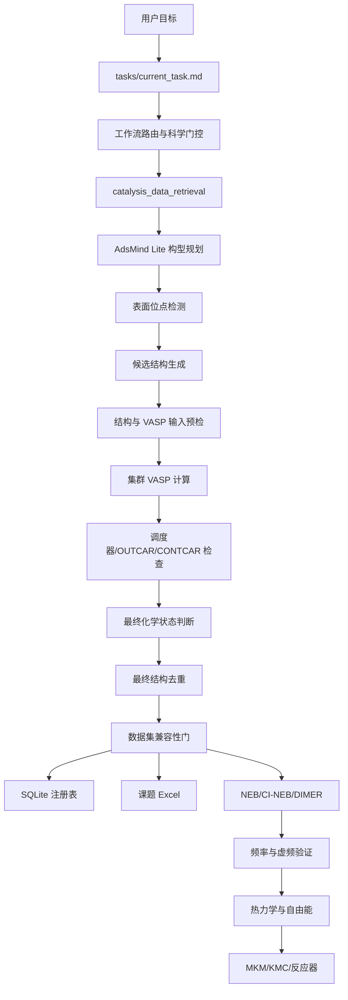

# 催化计算工作流：架构与核心代码学习指南

## 1. 先用一句话理解这个项目

这个仓库不是一个“按下按钮就自动算完”的单体程序，而是一条带科学审查门的流水线：

```text
外部证据 -> 构型规划 -> 表面位点 -> 初始结构 -> VASP 输入 -> 计算
        -> 收敛/几何审核 -> 去重 -> 数据兼容性 -> 数据库/Excel
        -> NEB/TS/热力学/动力学
```

每一层只回答一个问题。例如：

- 调度器只回答“任务是不是 DONE”，不回答“结构是否可信”；
- 几何检查只回答“结构是否合理”，不回答“能量是否可比较”；
- 数据兼容门只回答“能否进入同一个数据集”，不负责生成结构；
- 数据库只保存证据和结论，不替代科学判断。

这是整个框架最正确、也最值得保留的设计思想。

## 2. 仓库分成哪几层

| 层 | 主要位置 | 通俗解释 |
|---|---|---|
| 当前任务与状态 | `tasks/`、`docs/02_CURRENT_STATE.md` | 现在在做什么、做到哪一步 |
| 科学方法与门控 | `docs/`、`skills/`、模块 README | 什么条件下可以进入下一步 |
| 机器可读规则 | `configs/*.yaml` | 阈值、允许范围、位点和候选规则 |
| 核心执行代码 | `scripts/` | 真正读文件、生成结构、分析结果的 Python/Shell 代码 |
| 科学模块 | `modules/` | 按收敛、吸附、NEB、DIMER、动力学等阶段划分责任 |
| 运行数据 | `calculations/`、模块 `data/`/`outputs/` | 输入结构、任务目录、检索输出、计算产物 |
| 结果登记 | `modules/calculation_registry/`、SQLite、Excel | 任务、文件、数值、审核和来源 |
| 回归验证 | `tests/` | 防止修改后旧功能悄悄坏掉 |

一个初学者最容易混淆的是：`modules/` 主要描述“职责”，`scripts/` 才是主要实现代码，`skills/` 则是代理执行任务时要遵守的操作规程。

## 3. 整体架构图



核心原则是：箭头表示“可以把审核后的结果交给下一层”，不是“上一步运行结束就自动通过”。

## 4. 当前最重要的吸附构型调用链

### 4.1 规划阶段

```text
plan_adsorption_candidates.py
  -> evidence_gate.resolve_external_evidence()
  -> prescreen.plan_batch()
      -> prescreen.plan_species()
          -> fts_prescreen.plan_calibrated_fts_species()
  -> 输出 prescreen plan JSON
```

#### `scripts/adsmind_lite/plan_adsorption_candidates.py`

这是命令行入口。它主要做“胶水工作”：

1. 读取用户传入的物种名；
2. 读取预筛选、FTS 和外部证据规则；
3. 把外部证据转换成候选计划；
4. 调用 `plan_batch()`；
5. 输出 JSON 和简短终端摘要。

它不生成 POSCAR，也不提交任务。

#### `scripts/adsmind_lite/evidence_gate.py`

这个文件实现白名单优先规则：

- 白名单存在可用精确匹配时，禁止再跑文献回退；
- 只有 `NO_WHITELIST_MATCH` 才允许权威期刊记录；
- DOI、期刊审核、表面和吸附物必须精确匹配；
- 外部能量只能用于稳定性顺序，不能写入本地结果；
- 没有审核过的结构模板时，候选仍然不能直接构建。

最关键的函数是：

- `resolve_external_evidence()`：整个证据门的入口；
- `_accepted_literature_record()`：筛掉来源不完整的论文记录；
- `_collect_motifs()`：合并同一构型的多来源证据；
- `_plan()`：把稳定构型变成按优先级排序的候选计划。

#### `scripts/adsmind_lite/prescreen.py`

这个文件决定一个物种最终得到几个候选：

- 有已审查的物种规则时，使用规则中的候选；
- 有 Fe(110) FTS 校准规则时，使用校准构型；
- 没有可靠规则时，不猜四个位点，而是返回 `NEEDS_WHITELIST`；
- 缺结构模板时返回 `BLOCKED` 或 `PARTIAL`。

`plan_species()` 是单物种决策函数，`plan_batch()` 只是批量循环并统计数量。

#### `scripts/adsmind_lite/fts_prescreen.py`

这个文件保存化学启发式和已校准物种的选择逻辑：

- `plan_calibrated_fts_species()`：命中已审查物种时直接给出有限候选；
- `rank_carbon_sites()`：根据碳的配位需求排序位点；
- `plan_feature_based_fts_species()`：对未知物种生成“检索假设”，不能直接生成结构；
- `_plan_cc_mode()`：区分 C–C 的 di-sigma、eta2、pi-top、自由基端吸附等模式。

这里的“启发式”只用来缩小搜索范围，不是全局最低能量结论。

### 4.2 位点与结构生成阶段

```text
detect_surface_sites.py
  -> site_detection.detect_surface_sites()
      -> build_fe110_adsorption.generate_sites()

generate_adsorption_candidates.py
  -> core.generate_candidates()
      -> candidate_generation.generate_candidates()
          -> select_planned_sites()
          -> compose_candidate_structure()
          -> candidate_metadata()
```

#### `scripts/adsorption/build_fe110_adsorption.py`

这是当前 Fe(110) 吸附结构最核心的几何文件。

重要数据类型：

- `Poscar`：晶胞、元素、原子数、分数坐标、固定/放松标记；
- `Site`：位点名称、分数坐标、支撑 Fe 原子、支撑距离；
- `PairCandidate`：一对表面 Fe 的距离、中点和原子编号。

位点生成的实际算法：

```text
read_poscar()
  -> identify_top_layer()        找最高的 Fe 表面层
  -> pair_candidates()           列举表面 Fe-Fe 对
  -> cluster_pairs()             按距离分成短桥和长桥
  -> triangle_hollow_candidates()找“两短一长”三角形中心
  -> validate_site_set()         排除重复和假 hollow
```

其他关键函数：

- `classify_fe110_anchor_site()`：判断最终吸附原子更接近 top、短桥、长桥还是 hollow；
- `validate_adsorbate()`：检查吸附物坐标、锚点、方向和允许距离；
- `anchor_cartesian_position()`：通过二分法求满足目标 Fe–吸附原子距离的高度；
- `place_adsorbate()`：把吸附物坐标附加到干净表面；
- `write_poscar()`：写出 VASP POSCAR。

这个文件应继续保持为 Fe(110) 位点几何的唯一权威，不应在 AdsMind Lite 中复制同一算法。

#### `scripts/adsmind_lite/site_detection.py`

这是“表面类型路由器”：

- Fe(110) 调用上面的权威几何代码；
- Fe(100)/Fe(111) 使用通用金属表面检测；
- 碳化物和氧化物不自动猜位点，必须读取显式 manifest；
- 氧空位、晶格 C/O 等高风险位点必须显式标注。

#### `scripts/adsmind_lite/candidate_generation.py`

这是“把计划变成结构”的实现：

- `generate_candidates()`：批量控制器，遍历物种和候选；
- `select_planned_sites()`：把计划中的位点名映射到检测到的表面位点；
- `compose_candidate_structure()`：合并 slab 和 adsorbate，并重建元素分组和原子编号；
- `candidate_metadata()`：写下结构来源、锚点、原子索引、置信度和风险；
- `generation_failure()`：失败也保留记录，不静默丢弃。

#### `scripts/adsmind_lite/core.py`

它几乎没有业务逻辑，是兼容旧调用方的“门面文件”。旧代码可以继续 `from core import ...`，真正实现已经拆到多个文件。

新代码不应继续扩大这个门面的导出列表，应直接从责任模块导入。

### 4.3 计算后审核阶段

```text
relaxed_analysis.analyze_relaxed_tree()
  -> analyze_relaxed_candidate()
      -> connectivity_edges()
      -> classify_relaxed_site()
      -> maximum_slab_displacement()

state_deduplication.deduplicate_records()
  -> find_duplicate()
      -> kabsch_rmsd()
```

#### `scripts/adsmind_lite/relaxed_analysis.py`

它比较初始结构和 CONTCAR：

- 内部成键是否改变；
- 锚点是否迁移到新位点；
- 表面是否明显重构；
- 是否仍可推荐进入后续 VASP/数据流程。

#### `scripts/adsmind_lite/state_deduplication.py`

它先按“物种 + 最终位点 + 连通性”分组，再比较：

- 吸附物相对坐标的 Kabsch RMSD；
- 可选的能量差阈值。

目标是避免多个初始位点最后收敛到同一个状态，却在数据表里重复登记。

### 4.4 数据进入数据库和 Excel 的门

数据不能从 OUTCAR 直接跳到 Excel，中间至少需要：

```text
调度状态
  -> 电子收敛
  -> 离子/力收敛
  -> 最终结构
  -> chemical-plausibility-gate
  -> dataset-compatibility-gate
  -> calculation_registry
  -> Excel
```

- `configs/adsorption_result_promotion.yaml`：列出 Excel 推广所需字段和阻断条件；
- `skills/chemical-plausibility-gate/`：判断最终实际是什么化学物种；
- `skills/dataset-compatibility-gate/`：判断能量是否来自同一计算分支；
- `modules/calculation_registry/schema.sql`：保存计算、任务、文件、结果和审核。

## 5. NEB 到动力学的框架位置

这部分目前大多是模块接口，不是已经跑通的全自动流水线：

```text
已接受的吸附端点
  -> neb_agent/generate_path.py
  -> check_endpoints.py / diagnose_path_geometry.py
  -> VASP NEB / CI-NEB
  -> analyze_neb_outputs.py
  -> DIMER
  -> 虚频与连接性验证
  -> 热力学修正
  -> 反应网络
  -> MKM/KMC
  -> 反应器与不确定性
```

`scripts/neb_agent/` 的结构比 AdsMind Lite 更接近一个小型 Python 包：公共逻辑已拆到 `cli_common.py`、`utils_structure.py`、`utils_vasp.py` 和 `utils_report.py`。后续整理 AdsMind Lite 时可以参考这种布局。

## 6. 当前代码的优点

1. 科学阶段边界清楚，避免把 `DONE` 当作科学结果。
2. Fe(110) 位点算法有单一核心实现，并有回归测试。
3. 未知吸附物不会自动扩展成固定四个位点。
4. 外部能量被禁止进入本地吸附能，来源边界正确。
5. 失败记录会被保存，不是只保留成功结果。
6. 数据库把任务状态、文件证据、数值和审核分开保存。
7. 当前完整仓库回归测试和 Ruff 静态检查通过；测试数量和本次修改见第 11 节。

## 7. 需要优先修正的问题

### P0：可能影响科学语义或候选数量

#### 7.1--7.7 已完成的基础修复

2026-07-15 已完成以下修改：

- 候选身份使用 `site_class + configuration_id`，初始验证再比较真实相对几何；同位点不同方向不会仅因位点相同被删除。
- 连通性分析拆成 `connectivity_changed`、`chemical_event`、`lost_bonds`、`formed_bonds` 和碎片数；只有碎片数增加才标记 `dissociated=true`。
- 规划优先级落实为本地物种规则、已审核 FTS 校准、外部证据门；外部门内部仍严格执行白名单优先、无匹配后才允许权威文献。
- C₂/C₂O 标签集中到 UTF-8 目录，并对源文件、状态文档和生成 JSON 增加乱码回归测试。
- `scripts` 已成为 setuptools 可发现包，生产代码不再调用 `sys.path.insert()`；命令行入口使用 `python -m scripts.<module>`。
- slab-PBC、距离、相对坐标和元素展开的核心实现集中到 `scripts/workflow_geometry.py`。
- C₂/C₂O 共吸附代码拆为 `c2_coads_geometry.py`、`c2_coads_catalog.py` 和薄写出器 `build_fe110_c2_coads.py`。

### 7.8--7.12 已完成的第二批修复

2026-07-15 已继续完成：

- `configs/skill_routing.yaml` 成为唯一的 routing、owner 和规则来源映射；README 只解释，skill 只路由。
- `hard_contact_distance_angstrom: 0.80` 迁入 `analysis_rules.yaml`，并固定 `<0.80 Å` 拒绝、`=0.80 Å` 不因本规则拒绝的边界。
- 高风险几何和索引函数补充 Cartesian/分数坐标、Å、0-based 和 PBC 契约，并由结构测试保护。
- `core.py` 从约 50 个导出缩减为不超过 15 个稳定的端到端操作和序列化助手；CLI 直接导入所属模块。
- 特征式 FTS 规划器接入 `--species-features`，但只输出 `search_hypotheses`，候选数强制为零，不能绕过证据门生成结构。

## 8. 后续最小重构顺序

本轮已处理审查中列出的 P0/P1/P2 代码问题。后续只在新证据或新功能
暴露具体重复时做小步重构，不再预设一次大规模重写。

## 9. 初学者推荐阅读顺序

第一遍只理解数据流：

1. `docs/12_WORKFLOW_ARCHITECTURE.md`
2. `modules/README.md`
3. `modules/adsmind_lite/README.md`
4. `scripts/adsmind_lite/plan_adsorption_candidates.py`
5. `scripts/adsmind_lite/prescreen.py`
6. `scripts/adsorption/build_fe110_adsorption.py`
7. `scripts/adsmind_lite/candidate_generation.py`
8. `scripts/adsmind_lite/relaxed_analysis.py`
9. `scripts/adsmind_lite/state_deduplication.py`
10. `configs/adsorption_result_promotion.yaml`
11. `modules/calculation_registry/schema.sql`

第二遍再打开对应测试。测试通常比实现更容易说明“这个函数承诺什么”。

## 10. 学习代码时问自己的四个问题

读每个函数时只问：

1. 输入是什么，单位和索引规则是什么？
2. 它做的是科学决策、数据转换，还是文件 I/O？
3. 输出给谁使用？
4. 失败时会明确报错，还是可能静默产生错误数据？

如果一个函数同时回答很多问题，例如既选构型、又写文件、又做审核，它通常就是下一轮拆分的候选。

## 11. 本次审查范围与验证

本次重点检查了：

- AdsMind Lite 规划、证据、位点、生成、弛豫分析和去重；
- Fe(110) 通用吸附几何；
- C/C2/C2O/O 专用候选构建；
- 结果推广规则和 SQLite schema；
- NEB 与后续动力学的模块接口。

2026-07-27 全局审计与低风险重构后的实际验证：

```text
pytest 完整仓库：202 passed
Ruff 修改范围：All checks passed
```

这些验证证明当前自动化契约没有失败，但不能替代真实 VASP 结果的科学审核。
本轮没有重新验证 wheel 构建，因此不沿用历史构建结论。当前全局审计、
后续计划和剩余风险分别见根目录 `PROJECT_AUDIT.md`、`REFACTOR_PLAN.md`
和 `REFACTOR_REPORT.md`。
