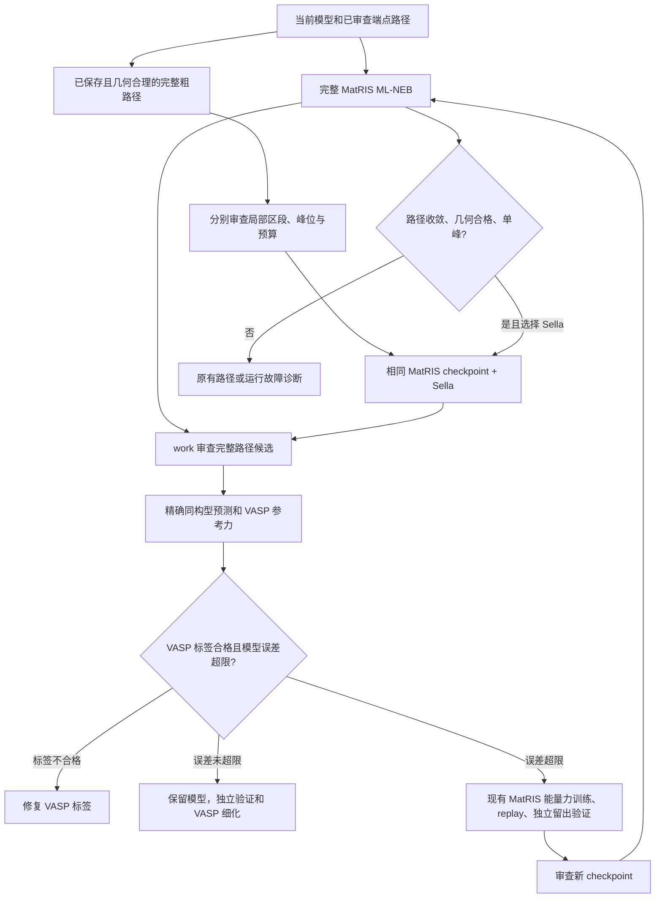

# 将 Sella 接入现有 MatRIS 主线

状态：本地候选生成、标注衔接和重跑准备已实现。2026-09-05 在 MZ73 的独立
测试目录完成 MatRIS/Sella 单构型组件验证（job 1509）；完整 NEB→Sella→VASP
闭环和同预算性能对照仍未执行。

此次使用当前 epoch-6 checkpoint 和现有 NEB 图像 03（50 个原子、18 个固定
原子），Sella 2.5.0 执行 3 步、调用模型 12 次，运行耗时 2.646 秒。
预测最大可动原子力从 1.508 降至 1.285 eV/Å，达到步数上限时仍未收敛。
4 个返回构型的哈希、原子顺序、固定掩码/坐标、晶胞和几何限制均通过 work
复核。未训练模型、未运行 VASP、未建立 TS 结论。
证据：`outputs/matris_sella_smoke_20260905/work_review.json`。该组件测试直接使用
已审查的现有构型，仅验证接口，不是绕过完整路径门槛的生产搜索分支。

## 方法选择

| 方法 | 当前作用 | 适用条件与限制 |
|---|---|---|
| MatRIS 完整 ML-NEB + AQCat25 检查 | 保留的主线 | 需要端点间完整路径；适合检查多步反应、路径连续性和中间态 |
| MatRIS ML-NEB → 标准 Sella | 新增可选分支 | 已有收敛、几何合格、单峰的 ML 路径，局部细化其峰值；继续使用同一 MatRIS checkpoint |
| 已保存粗路径 → 局部峰标准 Sella | 可选早期入口 | 父路径可未收敛、整体多峰；每次审查一个局部区段，绑定初猜、模型和预算，不重跑 NEB。见 [局部峰入口](SELLA_LOCAL_PEAK.md) |
| AQCat25 BA-Sella → VASP → 按误差微调 → BA-Sella | 保留的历史分支 | 有经审查的初猜及成断键映射；使用已有 AQCat25 顺序主动学习控制器，不能装入 MatRIS 权重 |

针对当前任务保留完整路径主线；增加已保存粗路径的局部峰入口，以便比较提前
搜索的实际收益。原有完整路径细化分支保持严格门槛。
这是根据现有代码和任务需求作出的工程选择，尚无本体系同预算对照能证明
哪条路线成功率最高。标准 Sella 与 Bond-Aware Sella 分开标记，未将前者冒充后者。

历史 GPU job 737 使用过 AQCat25/BA-Sella，产物是预测候选；当前 epoch-6
完整路径主线使用 MatRIS/NEB。新增分支不重置模型权重，不重启或替换已提交的
VASP job 9742743。局部主动学习状态的 `round_index=0` 表示这次诊断批次起点，
不表示从未训练的模型或空白策略开始。

## 闭环与代码分区



- `scripts/ml_sella_candidate.py`：可选 Sella 优化，固定晶胞和完整固定原子掩码；
  保存逐步构型、日志、最后有效构型和失败原因。暂不支持部分 Cartesian 固定掩码，
  遇到这种输入明确拒绝。
- `scripts/dual_model_ml_neb.py`：保留原路径；显式请求时才对合格峰值调用 Sella。
  Sella 候选另存，不替换 NEB 图像、路径峰值或 Dimer 父路径凭证。
- `scripts/matris_sella_local_peak.py`：已保存粗路径的独立局部入口及请求打包。
  `scripts/ml_candidate_source.py` 复用结构哈希、身份、端点和几何校验。
- `scripts/prepare_ml_candidate_active_learning.py`：检查 work 审查、模型和构型哈希，
  重新计算路径几何门槛，将两种候选接入原有双模型标注状态。
- `scripts/select_dual_model_ts_vasp_labels.py`：沿用每轮 5–7 个标签限制；Sella
  构型必须获得精确 VASP 标签，若与已选峰值文件完全相同则合并，避免重复计算。
- `scripts/prepare_ml_candidate_rerun.py`：消费现有任务范围的 checkpoint promotion，
  检查其保留集/留出集来源、模型文件和误差触发记录；生成新目录中的完整路径重跑包，
  保留 Sella 设置并递增诊断轮次。没有自动提升模型或自动提交。

标注、误差阈值、训练及最终 TS 验证均复用现有模块。路径/优化器失败不等于
模型错误；单点力吻合不等于鞍点或正确连接。最终仍需 VASP 细化、振动及端点连接
验证。策略比较继续使用 `learning compare` 的已验证覆盖率和真实成本。

## 使用接口

在**新的、待审查** `dual_model_ml_neb_request` 中加入 `sella_refinement`。
只接受三个字段：`fmax_eV_per_A`（正数）、`max_steps`（正整数）、`delta0_A`（正数）。
不提供该字段时执行原有 NEB；不支持任意优化器参数或改变鞍点阶数。
例如 `{ "fmax_eV_per_A": 0.05, "max_steps": 100, "delta0_A": 0.05 }`
是可审查配置示例，不是本体系已验证的最佳参数。

优化接口为 ASE `Sella(atoms, order=1, internal=False, delta0=...)`。
Sella 是可选依赖；本地解析势测试使用 2.6.0。部署时需一并提供
`ml_sella_candidate.py` 和兼容的 Sella/ASE 环境，先做授权范围内的小样本验证。
采用单目录部署时，模型加载器 `mlip_same_structure_benchmark.py` 还需同目录的
`artifact_io.py`；完整仓库部署使用同一个 `scripts.artifact_io`。独立目录导入由
`test_standalone_prediction_bundle_imports_without_repository` 验证，不加载模型或提交任务。
请求了 Sella 而依赖缺失时，在加载 MatRIS 和运行 NEB 前失败。

候选返回后的 work 审查 JSON 格式：

```json
{
  "document_kind": "dual_model_candidate_work_review",
  "candidate_manifest_sha256": "待审查路径 manifest 的实际 SHA-256",
  "reviewer": "实际审查者",
  "decision": "accepted_for_force_diagnosis_only"
}
```

以下大写参数为实际文件路径占位符，不可原样执行：

```powershell
python -m scripts.prepare_ml_candidate_active_learning --source-request REQUEST --manifest RETURNED_MANIFEST --review WORK_REVIEW --policy configs/dual_model_ts_active_learning.yaml --destination NEW_ROUND_DIR --method ml_neb_sella
```

仅使用原 NEB 候选时选 `--method ml_neb`。随后沿用已有的
`dual_model_ts_force_prediction_batch`、`select_dual_model_ts_vasp_labels`、
`collect_dual_model_ts_vasp_labels`、`assess_dual_model_ts_vasp_errors` 和 MatRIS
训练/留出验证接口。误差失败、训练完成且新 checkpoint 已被现有流程审查后：

```powershell
python -m scripts.prepare_ml_candidate_rerun --state ROUND_STATE --promotion CHECKPOINT_PROMOTION --destination NEW_RERUN_DIR
```

返回 `prepared_not_submitted`。全部初始路径图像保留，使用新 checkpoint 从完整
路径重新优化，再运行原选定的 Sella 分支。改变方法需新策略提案，不能隐藏切换。
中断后的 Sella 可用最后有效构型在新目录继续；这是坐标恢复，不保证恢复 Hessian。
保留原失败记录，使用现有 `learning start/outcome/check` 登记和检查精确输入条件。

## 来源与未验证内容

- [Sella 官方接口](https://github.com/zadorlab/sella)：标准鞍点优化器及 ASE 接口。
- [表面催化 BA-Sella 主动学习论文](https://arxiv.org/abs/2603.24482)：支持将局部
  TS 搜索与 DFT 标注、模型更新形成闭环的借鉴方向；其基准结果不代表本项目结果。
- [工作流演化论文](https://www.nature.com/articles/s41524-026-02301-9)：用于借鉴从
  成熟工作流迭代策略的思路；策略改良与势能模型微调是两个不同层次。

已验证一个真实 MatRIS+Sella GPU 小样本运行；尚未验证完整候选闭环、
DFT 成本下降或 Fe 表面 TS 成功率提升。
软件回归结果不能作为这些科学结论的证据。
