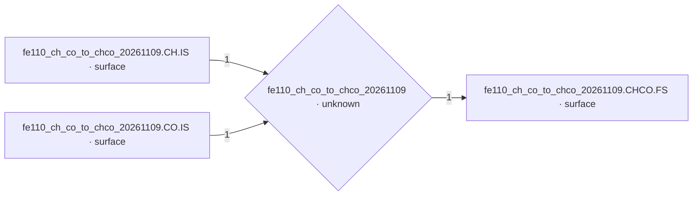

# Reaction network

Edges carry stoichiometric coefficients. Bidirectional arrows denote confirmed reversibility. Each reaction node joins all participants in that event.

```mermaid
flowchart LR
    s0["fe110_ch_co_to_chco_20261109.CH.IS · surface"]
    s1["fe110_ch_co_to_chco_20261109.CO.IS · surface"]
    s2["fe110_ch_co_to_chco_20261109.CHCO.FS · surface"]
    r0{"fe110_ch_co_to_chco_20261109 · unknown"}
    s0 -->|1| r0
    s1 -->|1| r0
    r0 -->|1| s2
```
