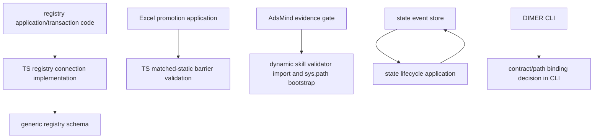
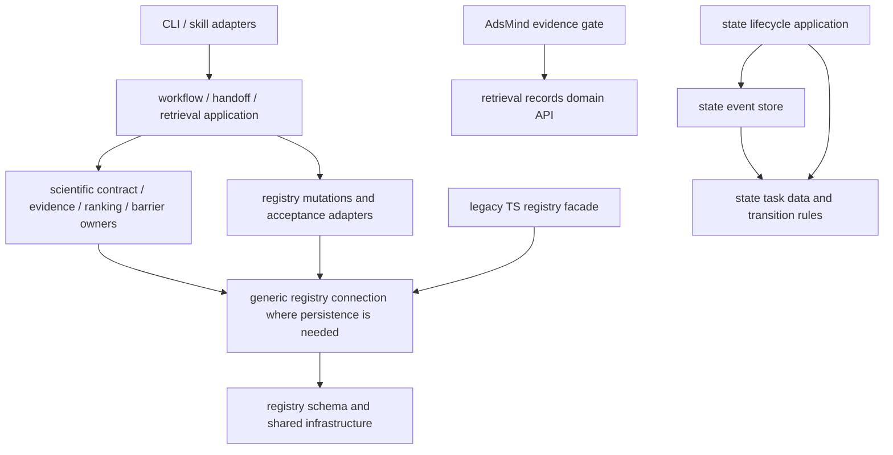

# B5 Architecture Boundary and Module Ownership Completion Report

Scope: B5 only. Base `fbbb7bb26d28867d9766cc7fca84077fa54cf3d6` from
`q2214299493/sbq123`, branch `codex/b5-architecture-boundaries`. Implementation and
validation use the isolated worktree `C:/Users/86177/AppData/Local/Temp/sbq123-b5-architecture-boundaries`.
The main worktree's 353 pre-existing status entries and HEAD are preserved; no
production database, output, historical event, POTCAR or model weight was edited.
No merge, B6 cleanup, B7 packaging redesign, remote job or model training.

## Closure status

| Item | Status | Evidence |
|---|---|---|
| B5-01 Registry inversion | PASS | One `registry_connection` implementation; all `scripts/registry_*.py` avoid TS-engine imports. Legacy TS imports re-export the same objects. |
| B5-02 Dependency audit | PASS | Maintained scripts/modules/skills/tests/configs/workflow paths inventoried; 294 Python files classified. Nested imports, dynamic skill import, SQL in CLI handlers and `sys.path` sites reviewed. State store/lifecycle cycle removed. |
| B5-03 Capability owners | PASS | Owner/support table below; AST tests enforce unique implementations of key gates, parsers' existing owners, registry connection/migration/apply, retrieval ranking and training split isolation. |
| B5-04 Thin adapters | PASS | DIMER binding, active-learning candidate discovery and learning preflight now live in existing application owners; retrieval command policy moved to retrieval workflow. Registry facade stays SQL-free. |
| B5-05 System assumptions | PASS (bounded supported systems) | Existing explicit Fe profiles retained; unknown metallic orientation returns NEEDS_REVIEW with no sites, unknown family errors. Positive Fe110 sites characterized before changes. No arbitrary catalyst support claimed. |
| B5-06 Support contract | PASS | Inputs, preconditions, owners, outputs, failures/recovery and tests listed below. Planned/Blocked modules remain unchanged. |
| B5-07 Proven duplication only | PASS | No speculative deletion. Moved implementations exist once; old paths re-export. Revalidation across execution/evidence/registry trust boundaries retained. |
| B5-08 Import/resource boundaries | PASS within B5 scope | Editable installation and ten import/CLI checks from an unrelated temporary cwd pass. Retrieval `sys.path` hacks/dynamic skill import removed. Remaining source/resource deployment issues recorded for B7. |
| B5-09 Regression protection | PASS | New semantic/import/identity/cycle/profile/application tests; existing architecture limits and scientific assertions retained. B3 no-promotion test additionally inspects the new ranking/application owners. |

## Before and after

Before (problem edges, not a complete historical architecture):



After:



`registry_mutations` is an application transaction boundary, not generic storage.
`registry_acceptance` and `registry_excel_promotion` deliberately consume scientific
owners; they cannot decide alternative science. Generic connection/schema/approval
infrastructure has no dependency on TS, adsorption or AdsMind. Convenience `main`
functions in existing domain/application files are adapter facets, not alternate
implementations. No `main`/`dispatch` handler in maintained scripts contains SQL
`execute`/`executemany`/`executescript` calls.

See [B5_dependency_inventory.md](B5_dependency_inventory.md) for per-file layers,
roles and import edges, plus non-Python maintained adapters. Classification uses
primary responsibility. Config/routing references retain preserved entrypoints;
module output paths were inventoried without opening or rewriting scientific data.
The static runtime import graph is acyclic after the change; dynamic skill loading
was inspected separately and replaced with a normal package import. Static analysis
does not prove the behavior of arbitrary external plugins or dynamically built code.

## Authoritative capabilities and support contracts

Implementation paths in the table are relative to `scripts/` unless a skill path
is named; test names refer to `tests/`. AUTHORITATIVE means implementation ownership,
not permission to execute or a claim of validated production performance.

| Capability / role | Authoritative owner; adapters | Supported input / preconditions | Output / failure / review recovery | Test evidence |
|---|---|---|---|---|
| TS strategy, AUTHORITATIVE + APPLICATION_ORCHESTRATION | `ts_strategy_engine/strategy.py`, `workflow.py`; `cli.py` CLI_ADAPTER | Semantically valid contract, mapped compatible endpoints, configured reaction family and current evidence | Strategy/decision evidence; blocked/unsupported family or missing evidence needs reviewed correction; no executor authority | `test_ts_strategy_engine`, B2/B2.1 tests |
| NEB path quality, AUTHORITATIVE | `neb_agent/path_quality_control.py`; `path_quality_service.py` APPLICATION_ORCHESTRATION | Bound path and configured thresholds | Quality verdict/reasons; fail/incomplete requires path review, never automatic action | `test_neb_path_quality_control`, `test_neb_path_quality_entrypoints` |
| Execution gate, AUTHORITATIVE | `ts_strategy_engine/execution_gate.py`; validation `execution_evidence.py` | Current scientific readiness plus exact scoped action/workdir/bundle/evidence authorization | Explicit ALLOWED_ACTIONS or rejection; refresh reviewed binding; <=160-line gate retained | `test_neb_execution_gate`, `test_code_structure` |
| NEB submission, AUTHORITATIVE | `neb_agent/submission.py` | Gate authorization, immutable reservation, current input manifest, backend restrictions | Receipt or UNKNOWN_NEEDS_RECONCILIATION; manual reconciliation, no automatic resubmission | `test_neb_submission` |
| DIMER analysis, AUTHORITATIVE | `ts_strategy_engine/dimer_analysis.py`, existing `dimer_gate.py` science; handoff APPLICATION_ORCHESTRATION | Current output, source-bound parent path and applicable convergence/geometry evidence | DIMER analysis or fail/review; unchanged handoff/soft-review requirements | `test_ts_strategy_engine`, `test_ts_handoff`, B2.1 tests |
| VFA/TS validation, AUTHORITATIVE | `ts_validation/analyze_vfa.py`, `validation_pipeline.py` and existing protocol owners | Source-bound saddle/frequencies, declared active atoms, method-specific evidence | Existing TS/grade/eligibility outputs or rejection/review; no new connectivity or DIMER requirement | `test_ts_validation`, `test_ts_validation_pipeline`, B2.1 tests |
| Registry mutation, AUTHORITATIVE | `registry_mutations.py`; `registry_write.py` CLI_ADAPTER | Valid batch, current schema, exact plan/approval/database identity | Atomic receipt/idempotent replay; rollback/failure event on failure; new review for stale state | B4/B4.1 registry tests |
| Registry connection/migration, AUTHORITATIVE | `registry_connection.py`, `registry_schema.py`; TS `registry.py` COMPATIBILITY_FACADE, `init_registry.py` CLI_ADAPTER | Existing current schema for open; explicit migration command on named DB | FK-enforced committed/rolled-back/closed connection; missing/old schema errors, explicit migration/review | `test_registry_schema`, new B5 characterization |
| Evidence lifecycle, AUTHORITATIVE | `adsmind_lite/evidence_lifecycle.py`; evidence_gate APPLICATION_ORCHESTRATION | Typed claims, current source/content/review/transfer bindings | Existing evidence stage or fail closed; reviewed refresh needed | B3 evidence tests; implementation unchanged |
| Retrieval ranking, AUTHORITATIVE | `catalysis_retrieval/records.py`, `ranking.py`; `workflow.py` APPLICATION_ORCHESTRATION; original skill CLIs COMPATIBILITY_FACADE/CLI_ADAPTER | Whitelisted records, bound real embeddings or explicit diagnostic lexical mode | At most five rankings, PASS only for ranking, DIAGNOSTIC_ONLY or STOP; human transfer review separate | `test_catalysis_retrieval`, B3 evidence tests, B5 application regression |
| MatRIS/AQCat data governance, AUTHORITATIVE | `matris_training_data.py`, `matris_training_exclusions.py`; existing preparation scripts APPLICATION_ORCHESTRATION | Bound VASP label sources and disjoint held-out/replay identities | Eligible package/receipt or rejection; repair evidence/splits before separate training authorization | B3 ML, MatRIS exclusion/training tests; implementations unchanged |
| Adsorption candidates, AUTHORITATIVE / DOMAIN_SPECIFIC | `adsmind_lite/site_detection.py`, `candidate_generation.py`, `relaxed_analysis.py`; `core.py` COMPATIBILITY_FACADE | Supported explicit surface/site policy, clean structure and reviewed motif plan | Candidates only; unknown profiles yield error or NEEDS_REVIEW with no implicit Fe defaults; inspect/label/review explicitly | `test_adsmind_lite`, `test_adsmind_framework_regressions`, B5 positive/unsupported tests |
| Compatible barriers, AUTHORITATIVE / DOMAIN_SPECIFIC | `ts_validation/barrier_values.py`; matched-static import re-export | Finite compatible final-energy-derived fields, nonnegative forward/reverse barriers | Same validated values or ValueError; owning TS evidence/acceptance remains separate | B2.1, Excel tests and B5 value characterization |

## Facades, duplication and supported profiles

Retained compatibility: all maintained TS registry connection/schema/hash/constants
imports; `matched_static_evidence.validate_barrier_values`; original retrieval
`validate_records`/`hybrid_search` callable imports and CLI options/output/exits;
existing AdsMind core and active-learning facades. New callers should import the
implementation owners above. Facades introduce no alternative state or rules.
No files were deleted or renamed. No parser/validator was replaced with a second
implementation. No proven duplicate scientific implementation was deleted:
connection helpers and retrieval functions were relocated once, and separate trust
boundary checks intentionally remain. State timestamps have a distinct format and
were not collapsed into registry UTC timestamps.

Fe110 input builders remain explicitly named `build_fe110_*`, using
`configs/true_fe110_production.yaml`. Fe100/Fe111 site support remains limited to
existing configured metallic detectors. Carbide/oxide require existing manifests
and role labels; no vacancy guessing or arbitrary-catalyst support was added.
The surface policy remains in `configs/adsmind_lite/{surfaces,site_rules}.yaml`.
TS reaction-family behavior remains in validated contracts/fingerprints and existing
family configuration. AQCat25/MZ73 and Sunboquan roles remain exclusively governed
by `configs/execution_backends.yaml`; generic persistence knows none of them.

`kinetic_data` remains Planned. Thermochemistry, reaction_network, baseline_mkm,
coverage_mkm, surface_kmc, reactor_simulation and sensitivity_uncertainty remain
Blocked as documented in the unchanged module map. Existing scaffold/files do not
establish functioning science. No status was promoted by this audit.

## Behavior preservation and validation

Eight characterization cases passed before ownership changes (connection lifecycle,
compatibility/barrier values and positive/unsupported Fe site behavior). Twenty-five
moved function ASTs match their original implementations exactly: connection/hash,
barrier scalar, state payload/phase, record validation and ranking functions.
Thirteen critical B1/B2/B3/schema files are byte-equivalent after newline normalization.
The original scientific assertions and architecture limits are retained. New CLI
application regressions additionally assert identical preflight/spec construction,
DIMER binding rejection, candidate ambiguity rejection and contract fallback.

Final focused command:

```text
python -m pytest -o addopts= -q tests/test_b5_architecture_boundaries.py tests/test_code_structure.py tests/test_registry_write.py tests/test_b4_registry_governance.py tests/test_registry_schema.py tests/test_registry_excel_promotion.py tests/test_catalysis_retrieval.py tests/test_b3_evidence_governance.py tests/test_ts_handoff.py tests/test_state_manager.py tests/test_ts_strategy_learning.py tests/test_aqcat25_ts_active_learning.py tests/test_aqcat25_path_active_learning.py tests/test_ts_strategy_engine.py tests/test_adsmind_lite.py
292 passed in 47.68s (exit 0)

python -m ruff check scripts modules tests
All checks passed! (exit 0)

python -m pytest -o addopts= -q
1054 passed in 265.15s (0:04:25) (exit 0)
```

Editable import checks used a disposable `venv --system-site-packages`, with
`pip install --no-deps --no-build-isolation -e .`. From an unrelated temporary cwd,
all ten checks exited 0: owner/facade identity and whitelist-resource import; six
`python -m ... --help` commands (registry write/init/promotion, TS CLI, learning CLI,
active-learning CLI); both original retrieval skill `--help` scripts; installed
`registry-write --help`. Module locations were verified to be the B5 worktree.
Only temporary SQLite databases, local fixtures and fake adapters were used.

## Remaining B6/B7 and production uncertainties

B6: historical `ARCHITECTURE.md` remains a historical snapshot. Current-state and
module-map summaries still refer to schema 8 while B4 source is schema 9; this
source/state distinction was recorded, not rewritten without live state evidence.
No historical event or module status was altered to make documentation appear fresh.
Repository startup audit exited 0 (zero errors, seven pre-existing worktree/root
layout warnings). End-sync preflight found no applicable proposals before the
existing `repository item changed after classification: sbq_catalyst_agent_workflow.egg-info/PKG-INFO`
error. The required `python -m scripts.state_manager.cli sync --safe-only` exited 1
with the same error before applying any managed projection. No historical event
was edited to bypass this unrelated blocker.

B7: wheel resource inclusion/relocation is not validated. Whitelist schemas and
scientific profiles remain repository resources; direct skill files now use the
normal installed package. A fully uninstalled checkout and deployed standalone GPU
bundle packaging remain separate release concerns. The existing direct-file bootstrap
in `modules/fe_convergence_baseline/validate_baseline.py` and test-only import paths
remain; neither is a duplicate scientific owner. Existing intentional standalone
GPU import fallbacks are unchanged to preserve B1 behavior.

No SSH, scheduler, VASP/GPU computation, model training or production writes were
invoked. Scientific production performance, remote deployment and real database
rollout are not newly validated. The known B4 reviewer identity/authentication and
unknown-operation reconciliation limitations remain.

## Exact B5 changed files

- `modules/calculation_registry/README.md`
- `modules/catalysis_data_retrieval/README.md`
- `modules/state_handoff/README.md`
- `modules/transition_state_search/README.md`
- `reports/refactor_audit/B5_completion_report.md`
- `reports/refactor_audit/B5_dependency_inventory.md`
- `scripts/README.md`
- `scripts/adsmind_lite/evidence_gate.py`
- `scripts/adsorption/finalize_step12a_gas_references.py`
- `scripts/adsorption/register_step12a_gas_reference_submission.py`
- `scripts/adsorption/register_step12a_oh_restart.py`
- `scripts/catalysis_retrieval/__init__.py`
- `scripts/catalysis_retrieval/ranking.py`
- `scripts/catalysis_retrieval/records.py`
- `scripts/catalysis_retrieval/workflow.py`
- `scripts/registry_compatibility.py`
- `scripts/registry_connection.py`
- `scripts/registry_excel_promotion.py`
- `scripts/registry_mutations.py`
- `scripts/registry_transactions.py`
- `scripts/state_manager/lifecycle.py`
- `scripts/state_manager/models.py`
- `scripts/state_manager/store.py`
- `scripts/ts_endpoint/database.py`
- `scripts/ts_strategy_engine/active_learning_cli.py`
- `scripts/ts_strategy_engine/active_learning_state.py`
- `scripts/ts_strategy_engine/cli_commands.py`
- `scripts/ts_strategy_engine/handoff.py`
- `scripts/ts_strategy_engine/learning_cli.py`
- `scripts/ts_strategy_engine/matched_static_evidence.py`
- `scripts/ts_strategy_engine/registry.py`
- `scripts/ts_strategy_engine/workflow.py`
- `scripts/ts_validation/barrier_values.py`
- `skills/catalysis-data-retrieval/scripts/hybrid_search.py`
- `skills/catalysis-data-retrieval/scripts/validate_records.py`
- `tests/test_b3_evidence_governance.py`
- `tests/test_b5_architecture_boundaries.py`
