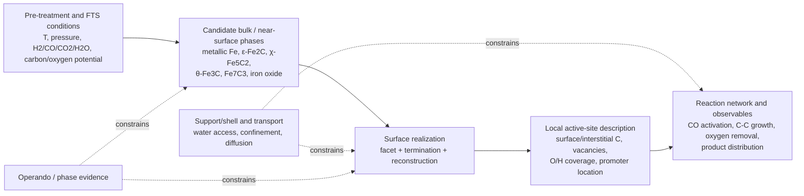
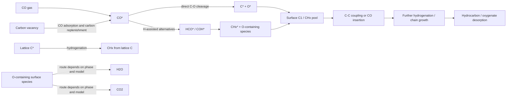
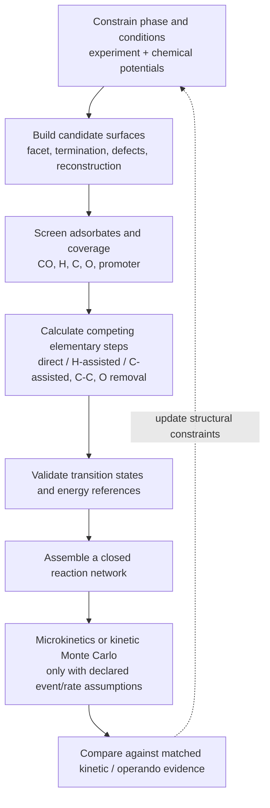

# Iron-Based Fischer–Tropsch Computational Literature: Method Reference

**Reviewed:** 2026-09-25
**Scope:** 40 DOI-distinct primary computational, surface-science, kinetic,
operando, isotope-tracing, and combined theory/experiment papers relevant to
iron and iron-carbide Fischer–Tropsch synthesis (FTS): the original 20-paper
mechanism set, seven evidence-bridge papers, and 13 phase/condition/defect
extensions. This
is a source-linked methodology reference, not an accepted local calculation
result, parameter set, or claim that one mechanism is settled. The summaries
are deliberately limited to publisher metadata/abstracts and checked article
text where accessible; they are not a substitute for reading the full papers
and supporting information.

## Curated primary literature

| Work | Computational question and reported conclusion | Methodological use and boundary |
|---|---|---|
| Ojeda et al., “CO activation pathways and the mechanism of Fischer–Tropsch synthesis,” *Journal of Catalysis* **272** (2010), 287–297. [DOI](https://doi.org/10.1016/j.jcat.2010.04.012) | Combines kinetic analysis and DFT for representative Fe and Co surfaces. The authors report H-assisted CO activation as predominant under the studied practical FTS conditions, while direct and H-assisted routes can coexist on Fe; oxygen removal differs between water- and CO₂-forming routes. | Compare direct and H-assisted pathways together with kinetic observables and oxygen balance. This is not a universal verdict for every Fe phase, facet, promoter, coverage, or condition. |
| “Stability and Reactivity of ε–χ–θ Iron Carbide Catalyst Phases in Fischer–Tropsch Synthesis: Controlling μC,” *Journal of the American Chemical Society* **132** (2010), 14928–14941. [DOI](https://doi.org/10.1021/ja105853q) | Combines in-situ characterization under synthesis conditions with DFT analysis of ε-, χ-, and θ-carbide phase formation as a function of gas composition and temperature. | Treat active-phase identity as condition-dependent; compare phase stability under an explicit carbon chemical potential rather than assuming one bulk carbide. The phase diagram does not by itself identify every working surface site. |
| Cao et al., “Chain growth mechanism of Fischer–Tropsch synthesis on Fe₅C₂(001),” *Journal of Molecular Catalysis A: Chemical* **346** (2011), 55–69. [DOI](https://doi.org/10.1016/j.molcata.2011.06.009) | DFT on a specified co-adsorbed H₂/CO Fe₅C₂(001) model reports competitive CCO hydrogenation/coupling and proposes CO-insertion chain initiation together with carbide-type propagation. | Keep initiation, propagation, and termination as separate questions; do not transfer its facet-specific pathways or energies to metallic Fe(110) or another carbide facet. |
| “CO₂ formation mechanism in Fischer–Tropsch synthesis over iron-based catalysts: a combined experimental and theoretical study,” *Catalysis Science & Technology* **8** (2018), 5288–5301. [DOI](https://doi.org/10.1039/C8CY01621F) | Combines experiment and DFT and attributes the studied CO₂ formation behavior to phase- and promoter-dependent routes, including Boudouard chemistry on χ-Fe₅C₂ and RWGS involvement associated with Fe₃O₄. | Track oxygen fate and catalyst phase/promoter state when comparing mechanisms. The result is tied to the investigated catalyst and conditions, not a universal oxygen-removal rule. |
| “Mechanisms of CO Activation, Surface Oxygen Removal, Surface Carbon Hydrogenation, and C–C Coupling on the Stepped Fe(710) Surface from Computation,” *The Journal of Physical Chemistry C* **122** (2018), 15505–15519. [DOI](https://doi.org/10.1021/acs.jpcc.8b04265) | Periodic DFT on a stepped Fe(710) model reports direct CO dissociation as more favorable than the H-assisted HCO/COH routes in that model. | Retain the direct-cleavage pathway as a competing hypothesis. Contrast with condition/coverage-aware kinetic studies; the Fe(710) result is not proof that direct cleavage dominates on all iron catalysts. |
| Yin et al., “A DFT study towards dynamic structures of iron and iron carbide and their effects on the activity of the Fischer–Tropsch process,” *RSC Advances* **13** (2023), 34262–34272. [DOI](https://doi.org/10.1039/D3RA06467K) | Uses structure search, ab-initio atomistic thermodynamics, Wulff construction, and semi-quantitative microkinetics to examine Fe(100)/(110)/(210) surfaces with varying carbon content and carbon chemical potential. | Consider carbon-dependent surface structures and phase stability instead of assuming an immutable bulk-truncated surface. The resulting activity/selectivity estimates remain model-dependent. |
| Liu et al., “An optimal Fe–C coordination ensemble for hydrocarbon chain growth: a full Fischer–Tropsch synthesis mechanism from machine learning,” *Chemical Science* **14** (2023), 9461–9475. [DOI](https://doi.org/10.1039/D3SC02054A) | Uses ML-assisted transition-state exploration and DFT for a broad reaction network on selected reconstructed FeCₓ surfaces; the paper proposes a particular Fe–C ensemble for CO activation and chain growth. | Surface reconstruction and network-wide pathway search can change conclusions drawn from a few bulk-truncated elementary steps. Treat the proposed ensemble and network as the paper’s model result, not an established universal active site. |
| Elahifard, Jigato & Niemantsverdriet, “Direct versus Hydrogen-Assisted CO Dissociation on the Fe(100) Surface: a DFT Study,” *ChemPhysChem* **13** (2012), 89–91. [DOI](https://doi.org/10.1002/cphc.201100759) | Periodic DFT comparison of direct C–O cleavage and HCO/COH-assisted routes on metallic Fe(100); the authors discuss HCO as potentially competitive under high hydrogen pressure and high surface occupation. | A useful metallic-Fe baseline. The conclusion is conditional on the ideal Fe(100) model and coverage/pressure assumptions; do not transfer it directly to carbide surfaces. |
| Pham et al., “CO Activation Pathways of Fischer–Tropsch Synthesis on χ-Fe₅C₂ (510): Direct versus Hydrogen-Assisted CO Dissociation,” *The Journal of Physical Chemistry C* **118** (2014), 10170–10176. [DOI](https://doi.org/10.1021/jp502225r) | Spin-polarized DFT, surface-energy/Wulff analysis and pathway comparisons on χ-Fe₅C₂(510), including multiple adsorption sites and six direct/H-assisted routes; this model favors direct dissociation. | Treat as one facet-specific result. Its preferred route is not a universal verdict, especially given later multi-facet and coverage-dependent studies. |
| Özbek & Niemantsverdriet, “Elementary reactions of CO and H₂ on C-terminated χ-Fe₅C₂(001) surfaces,” *Journal of Catalysis* **317** (2014), 158–166. [DOI](https://doi.org/10.1016/j.jcat.2014.06.009) | Periodic DFT varies surface-carbon content on C-terminated Hägg-carbide (001). Perfect, partially carbon-vacant and carbon-free terminations give different CO activation/carbidic-carbon hydrogenation behavior; the paper treats the surface as dynamically exchanging carbon with CO-derived species. | A strong example of why vacancy concentration/termination belongs in the system definition. Compare carbon-vacancy and lattice-carbon pathways, not only adsorbate pathways on one frozen slab. |
| Petersen & Janse van Rensburg, “CO Dissociation at Vacancy Sites on Hägg Iron Carbide: Direct Versus Hydrogen-Assisted Routes Investigated with DFT,” *Topics in Catalysis* **58** (2015), 665–674. [DOI](https://doi.org/10.1007/s11244-015-0405-x) | DFT on χ-Fe₅C₂(010), comparing direct and HCO-mediated cleavage at carbon-vacancy and non-vacancy sites; the reported overall barriers for the two leading routes are close (1.42 and 1.41 eV), with different favored vacancy geometries. | Do not resolve a near tie by quoting more digits. Site identity and vacancy placement are part of the comparison; report uncertainty/model sensitivity and avoid comparing the numbers to other facets as if they shared a reference model. |
| Özbek & Niemantsverdriet, “Methane, formaldehyde and methanol formation pathways from carbon monoxide and hydrogen on the (001) surface of the iron carbide χ-Fe₅C₂,” *Journal of Catalysis* **325** (2015), 9–18. [DOI](https://doi.org/10.1016/j.jcat.2015.01.018) | Periodic DFT on C-terminated χ-Fe₅C₂(001) with different surface-carbon contents follows CHₓ/CH₄ and C₁ oxygenate formation. The paper reports a Mars–van Krevelen-like lattice-carbon hydrogenation/regeneration cycle and identifies HCO as a branch point toward activation/oxygenates. | Keep methane, oxygenate and chain-growth questions distinct; carbon content changes the rate-determining step. A modeled pathway does not establish product selectivity without a complete kinetic and condition-matched comparison. |
| Broos et al., “Quantum-Chemical DFT Study of Direct and H- and C-Assisted CO Dissociation on the χ-Fe₅C₂ Hägg Carbide,” *The Journal of Physical Chemistry C* **122** (2018), 9929–9938. [DOI](https://doi.org/10.1021/acs.jpcc.8b01064) | DFT compares direct, H-assisted and C-assisted pathways over several thermodynamically relevant χ-Fe₅C₂ terminations. The paper finds the route depends on surface/interstitial carbon and termination; C-assisted and direct pathways can be competitive. | Include stable terminations and carbon topology in a mechanism comparison. Barrier height alone is insufficient where adsorption energies and product binding alter the effective rate. |
| He et al., “CO Direct versus H-Assisted Dissociation on Hydrogen Coadsorbed χ-Fe₅C₂ Fischer–Tropsch Catalysts,” *The Journal of Physical Chemistry C* **122** (2018), 20907–20917. [DOI](https://doi.org/10.1021/acs.jpcc.8b06988) | Spin-polarized DFT compares direct and H-assisted routes on nine low- and high-index χ-Fe₅C₂ slabs with coadsorbed H. Direct activation is favored on some high-index/less-stable models, while H-assisted paths are preferred on several other facets; stable (100) is comparatively inactive in their models. | This is a direct demonstration that facet and coverage can reverse the pathway ranking. Preserve the exact termination and H coverage when reusing the conclusion. |
| Zhang, Ren & Yu, “Insights into the Hydrogen Coverage Effect and the Mechanism of Fischer–Tropsch to Olefins Process on Fe₅C₂ (510),” *ACS Catalysis* **10** (2020), 689–701. [DOI](https://doi.org/10.1021/acscatal.9b03639) | DFT on χ-Fe₅C₂(510) explicitly considers H coverage for FTO. Under H-covered conditions the authors favor CO-insertion chain growth over a carbide mechanism and analyze C–C coupling and olefin/paraffin branching. | Separate clean-surface pathway rankings from coverage-conditioned mechanism claims. The olefin conclusion belongs to the modeled FTO conditions and should be checked against coverage and kinetic assumptions. |
| Ren, Ai & Yu, “Insight into the Fischer–Tropsch mechanism on hcp-Fe₇C₃ (211) by density functional theory: the roles of surface carbon and vacancies,” *RSC Advances* **11** (2021), 34533–34543. [DOI](https://doi.org/10.1039/D1RA06396K) | DFT on hcp-Fe₇C₃(211) assigns separate roles to neighboring surface-carbon and vacancy sites: surface carbon participates in C–C coupling, while carbon vacancies activate CO and can be restored by CO-derived carbon. | Use as a phase/facet-specific lattice-carbon-cycle hypothesis. Explicitly track which carbon atoms are lattice carbon versus feed-derived carbon in atom balances. |
| Ren et al., “Insights into the Fischer–Tropsch mechanism on χ-Fe₅C₂(510) based on the hydrogen coverage effect,” *Molecular Catalysis* **538** (2023), 112990. [DOI](https://doi.org/10.1016/j.mcat.2023.112990) | DFT-derived elementary-step network plus kinetic Monte Carlo on χ-Fe₅C₂(510), integrating CO activation, hydrogenation, C–C coupling and chain dissociation. The authors report coexisting growth/dissociation pathways and coverage-dependent pathway frequencies. | This progresses from isolated barriers to a network/dynamic simulation. It remains conditional on the chosen event set, rates, slab and kinetic setup; it is not equivalent to experimental validation. |
| Chen et al., “Effect of surface carbon of iron carbide on Fischer-Tropsch synthesis: A density functional theory study,” *International Journal of Hydrogen Energy* **86** (2024), 844–852. [DOI](https://doi.org/10.1016/j.ijhydene.2024.08.504) | Compares ε-Fe₂C(111) and θ-Fe₃C(111) with DFT, focusing on low-coordinated surface carbon, CO/H₂ activation, hydrogenation and direct C–C coupling. The paper reports different reactivity associated with phase-specific carbon topology. | A useful cross-phase controlled comparison, but phase, termination and carbon coordination all change together. Do not attribute every difference to one descriptor unless the comparison isolates it. |
| Zhao et al., “Unique Chain-Growth and oxygen removal mechanisms in Fischer-Tropsch synthesis on the ε-Fe₂C (1̅21) Surface: Insights from DFT calculations and microkinetic modeling,” *Fuel* **394** (2025), 134907. [DOI](https://doi.org/10.1016/j.fuel.2025.134907) | DFT reaction network and microkinetics on ε-Fe₂C(1̅21), with and without carbon vacancies; examines CO activation, chain growth, methane and oxygen removal. The authors propose CO/CHO insertion and CH coupling branches and a role for vacancy-associated CH in water formation. | Adds a phase/facet beyond Hägg carbide and couples barriers to a kinetic model. Treat the reported selectivity and oxygen route as model-specific until independently compared with matched evidence. |
| Ren et al., “A Computational Study of K Promotion of CO Dissociation on Hägg carbide,” *Catalysis Science & Technology* **15** (2025), 3262–3274. [DOI](https://doi.org/10.1039/D4CY01463D) | Spin-polarized DFT on K₂O-promoted χ-Fe₅C₂ models examines direct/H-assisted dissociation and charge redistribution; the authors report that effective promotion requires K close to the active site. | Promoter identity alone is not a sufficient model descriptor. Specify promoter chemical state, location, distance to the reacting site and surface termination; do not transfer a K₂O result to K metal or another promoter. |
| Jiang & Carter, “Adsorption and dissociation of CO on Fe(110) from first principles,” *Surface Science* **570** (2004), 167–177. [DOI](https://doi.org/10.1016/j.susc.2004.07.035), [author-hosted paper](https://cpb-us-w2.wpmucdn.com/research.seas.ucla.edu/dist/c/2/files/2019/08/EAC-154.pdf) | Spin-polarized periodic DFT compares CO adsorption at 0.25 and 0.50 ML and direct dissociation on metallic Fe(110); PBE, RPBE and PKZB give materially different energetics. The PBE on-top-starting dissociation barrier reported for this *seven-layer model* is 1.52 eV. | A direct Fe(110) model/method benchmark, **not** a transferable barrier for the project's five-layer Fe(110), its coverages or its reaction paths. Preserve the starting adsorption site, coverage, XC functional, slab, reference and final-energy convention. |
| Shipilin et al., “In Situ Surface-Sensitive Investigation of Multiple Carbon Phases on Fe(110) in the Fischer–Tropsch Synthesis,” *ACS Catalysis* **12** (2022), 7609–7621. [DOI](https://doi.org/10.1021/acscatal.2c00905) | In-situ XPS, surface diffraction, mass spectrometry and calculations track Fe(110) single-crystal surface evolution as pressure, temperature, time and CO/H₂ feed change. The authors distinguish octahedrally coordinated and trigonal-prismatic carbon environments; diffraction detects ordered θ-Fe₃C under its tested conditions. | Experimental counterweight to a permanently clean metallic slab. The surface-sensitive model experiment reaches up to 700 mbar, not all industrial FTS conditions; identified phases and proposed mechanism must remain tied to each instrument and condition. |
| “Isotopic Exchange Study on the Kinetics of Fe Carburization and the Mechanism of the Fischer–Tropsch Reaction,” *ACS Catalysis* **12** (2022), 2877–2887. [DOI](https://doi.org/10.1021/acscatal.1c05634), [institutional paper](https://repository.tudelft.nl/file/File_591abbde-1465-4d8e-8bc6-cf21ea3f8dd6) | Switching between ¹²CO and ¹³CO over Raney-derived Fe carbide, with temperature-programmed hydrogenation, Mössbauer and transient kinetics, measures carbon entry/exchange. The authors infer coexisting slow lattice-carbon/Mars–van Krevelen-like and faster adsorbate/Langmuir–Hinshelwood-like contributions; the former contributes approximately 10% in their studied steady state. | Do not turn a modeled lattice-carbon cycle into exclusive turnover. The paper's detailed transient kinetic assignment concerns CH₄ formation and does **not** directly establish the carbon source for every C₂⁺ product. |
| Chang et al., “Relationship between Iron Carbide Phases (ε-Fe₂C, Fe₇C₃, and χ-Fe₅C₂) and Catalytic Performances of Fe/SiO₂ Fischer–Tropsch Catalysts,” *ACS Catalysis* **8** (2018), 3304–3316. [DOI](https://doi.org/10.1021/acscatal.7b04085) | Fe/SiO₂ catalysts with different pretreatments are analyzed by XRD, XAFS, in-situ Mössbauer and TEM. The authors estimate phase-specific intrinsic activity after accounting for measured phase mixture and particle size; their abstract reports Fe₇C₃ as highest among the compared carbides under medium-temperature FTS conditions. | This is an experimentally inferred phase/activity attribution on a supported, often mixed-phase catalyst, not a direct measurement of one ideal single-crystal facet. The full article is access-limited here; summary is restricted to the publisher abstract. Original figure numbers remain unverified. |
| Wu et al., “Facet sensitivity of iron carbides in Fischer–Tropsch synthesis,” *Nature Communications* **15** (2024), 6108. [DOI](https://doi.org/10.1038/s41467-024-50544-1) | Compares differently shaped Fe₃O₄-core/χ-Fe₅C₂-shell catalysts exposing predominantly {202} or {112} facets. The authors report strong facet dependence of activity/stability but less pronounced dependence of chain growth under their FTS conditions. | An experimental facet comparison with different particle morphologies and a core–shell interface; it does not make an isolated χ-Fe₅C₂ slab or metallic Fe(110) interchangeable with the measured particles. |
| Wang et al., “Efficient conversion of syngas to linear α-olefins by phase-pure χ-Fe₅C₂,” *Nature* **635** (2024), 102–107. [DOI](https://doi.org/10.1038/s41586-024-08078-5) | Combines preparation/characterization of phase-pure χ-Fe₅C₂, FTS product measurements and DFT-based microkinetic simulation on χ-Fe₅C₂(100). Its model separates CO activation, oxygen removal, chain growth and termination; the paper also examines promoter-dependent olefin/paraffin outcomes. | Keep **experimental reactor results** separate from the **zero-conversion, 0.1 MPa model** and from promoted-catalyst results at different conditions. Predicted pathway flux is not a direct experimental observation and does not transfer to metallic Fe(110). |
| van der Laan & Beenackers, “Intrinsic kinetics of the gas–solid Fischer–Tropsch and water gas shift reactions over a precipitated iron catalyst,” *Applied Catalysis A: General* **193** (2000), 39–53. [DOI](https://doi.org/10.1016/S0926-860X(99)00412-3) | Measures rates over Fe–Cu–K–SiO₂ at 523 K while varying pressure, H₂/CO ratio and space velocity; fits multiple FT and WGS rate expressions. The abstract reports three FT rate models as statistically indistinguishable after screening. | Reactor-scale kinetic constraints are valuable for mechanism discrimination, but fitted rate laws do not uniquely identify one atomistic step or the active phase. Do not numerically merge these fitted parameters with unsupported DFT barriers. |
| González, Miranda & Ferrer, “A thermal desorption study of the adsorption of CO on Fe(110); enhancement of dissociation by surface defects,” *Surface Science* **119** (1982), 61–70. [DOI](https://doi.org/10.1016/0039-6028(82)90187-X) | Thermal desorption on annealed versus slightly Ar-sputtered Fe(110) reports greater CO dissociation after defect creation (20% versus 36% of adsorbed CO in that experiment). | An experimental defect/ideal-surface contrast for site selection. These fractions are preparation- and measurement-specific, not universal dissociation probabilities or DFT barriers. |
| “Density functional study of the adsorption of CO on Fe(110),” *Surface Science* **507–510** (2002), 99–102. [DOI](https://doi.org/10.1016/S0039-6028(02)01182-2) | DFT considers clean Fe(110) and 0.25/0.50 ML CO. It predicts on-top binding at lower coverage and an off-symmetry site at 0.50 ML, whereas comparison to measured vibrations favors on-top adsorption at both coverages. | Preserve a theory–spectroscopy discrepancy; site assignment cannot be decided by adsorption energy alone. Later Fe(110) studies should be compared at matched coverage, functional and geometry. |
| Chakrabarty et al., “Influence of surface vacancy defects on the carburisation of Fe(110) surface by carbon monoxide,” *The Journal of Chemical Physics* **145** (2016), 044710. [DOI](https://doi.org/10.1063/1.4958966) | DFT compares clean and vacancy-defected Fe(110) across CO adsorption, cleavage and carbon subsurface diffusion; the authors find the complete modeled carburization sequence more favorable near a vacancy. | Extend an ideal-slab mechanism test to a controlled defect model. A lower modeled barrier near one vacancy is not proof of the dominant defect population under FTS conditions. |
| “Atomic and molecular adsorption on Fe(110),” *Surface Science* **667** (2018), 54–65. [DOI](https://doi.org/10.1016/j.susc.2017.09.002) | Periodic PW91 DFT at 0.25 ML surveys H, C, O, CO, HCO, COH and other adsorbates/fragments, with preferred sites, vibrations, diffusion estimates and decomposition thermochemistry. | Use as a broad Fe(110) intermediate/site inventory before selecting reaction endpoints. Its PW91 energetics and 0.25-ML structures are not directly interchangeable with the project's PBE five-layer branch. |
| “Effect of CO₂-Rich Syngas on the Chemical State of Fe(110) during Fischer–Tropsch Synthesis,” *The Journal of Physical Chemistry C* (2024). [DOI](https://doi.org/10.1021/acs.jpcc.3c08180) | In-situ XPS compares Fe(110) under CO/H₂ with CO₂-containing syngas at 85–550 mbar, tracking changes in surface iron/carbon/oxygen chemical state. | Feed composition belongs in the surface-state boundary. The authors' proposed carbonate-related reduction route is an interpretation, not a directly established elementary mechanism. |
| “Genesis of iron carbides and their role in the synthesis of hydrocarbons from synthesis gas,” *Journal of Catalysis* **243** (2006), 199–211. [DOI](https://doi.org/10.1016/j.jcat.2006.07.012) | Varies H₂, CO and syngas activation of pure/Ce- or Mn-promoted Fe catalysts, with TPSR/TPD, XRD, Raman, selected Mössbauer and FTS tests; the authors report different carbide trajectories, including cementite evolving toward Hägg carbide under reaction conditions. | Activation history and promoter must accompany any phase–activity claim. The catalyst is not a clean Fe(110) single crystal, and post-treatment phase analysis does not uniquely identify a working surface site. |
| Xu et al., “ε-Iron carbide as a low-temperature Fischer–Tropsch synthesis catalyst,” *Nature Communications* **5** (2014), 5783. [DOI](https://doi.org/10.1038/ncomms6783) | Rapidly quenched skeletal Fe is carburized under low-temperature FTS; synchrotron XRD, EXAFS and Mössbauer jointly support an ε-Fe₂C-dominant catalyst and separate difficult-to-distinguish O-carbides. | Use multiple complementary phase probes, not a single diffraction pattern. The low-temperature nanoparticle result does not imply ε-Fe₂C is the active phase in a different high-temperature Fe(110) calculation. |
| Santos et al., “Metal organic framework-mediated synthesis of highly active and stable Fischer–Tropsch catalysts,” *Nature Communications* **6** (2015), 6451. [DOI](https://doi.org/10.1038/ncomms7451) | Fe-rich MOF precursor yields dispersed carbide particles in porous carbon; characterization and FTS time-on-stream tests link spatial confinement to reduced sintering, carbon deposition and phase-change deactivation in this system. | Add particle size, carbon matrix, diffusion and time-on-stream as experimental boundaries. An isolated slab cannot represent all support and transport effects. |
| Wang et al., “Synthesis of stable and low-CO₂ selective ε-iron carbide Fischer–Tropsch catalysts,” *Science Advances* **4** (2018), eaau2947. [DOI](https://doi.org/10.1126/sciadv.aau2947) | Controlled pretreatment/carburization, operando Mössbauer, XRD, environmental TEM and reactor tests connect an ε(′)-carbide-rich catalyst with low CO₂ formation in the studied conditions; CO₂-versus-conversion analysis distinguishes primary from secondary CO₂ contributions. | Retain conversion, water and WGS when interpreting CO₂ selectivity; the extrapolation is an inference under a specific catalyst/reactor protocol, not universal oxygen bookkeeping. |
| Lyu et al., “Stabilization of ε-iron carbide as high-temperature catalyst under realistic Fischer–Tropsch synthesis conditions,” *Nature Communications* **11** (2020), 6219. [DOI](https://doi.org/10.1038/s41467-020-20068-5) | Graphene confinement stabilizes ε-Fe₂C nanocrystals at elevated FTS temperature; experiment is paired with DFT analysis of interfacial/carburization stability and carbon chemical potential. | Separate intrinsic carbide chemistry from confinement and transport effects. Chemical-potential stability is a model-conditioned phase argument, not a direct measurement of every surface atom. |
| “Fischer–Tropsch synthesis and water gas shift kinetics for a precipitated iron catalyst,” *Catalysis Today* **275** (2016), 49–58. [DOI](https://doi.org/10.1016/j.cattod.2016.01.006) | Fe–Si–K catalyst data over low/high CO conversion are fit to simultaneous FT/WGS kinetic forms; the authors test 26 models and report an improved description including CO₂ inhibition in their FTS model. | Treat CO₂, H₂O and conversion as kinetic covariates, not just gas products. Fitted H-assisted and formate route assignments remain mechanistic hypotheses, not uniquely observed steps. |
| Xu et al., “Effects of surface hydrophobization on the phase evolution behavior of iron-based catalyst during Fischer–Tropsch synthesis,” *Nature Communications* **15** (2024), 7099. [DOI](https://doi.org/10.1038/s41467-024-51472-w) | In-situ XRD and CO+H₂O model exposures compare hydrophilic versus hydrophobic Fe–Mn/SiO₂-shell catalysts; water access and shell thickness alter Fe₅C₂-to-Fe₃O₄ evolution and FTS performance. | Model water-driven reoxidation as a competing state change; do not infer that a hydrophobic shell only changes an elementary barrier, because mass transfer and shell geometry also change. |
| Qian et al., “Stabilized ε-Fe₂C catalyst with Mn tuning to suppress C₁ byproduct selectivity for high-temperature olefin synthesis,” *Nature Communications* **15** (2024), 5128. [DOI](https://doi.org/10.1038/s41467-024-49472-x) | Mn-modified ε-Fe₂C is studied through phase/FTS characterization, pulse experiments, ab-initio nanoreactor simulations and static DFT on ε-Fe₂C(001)/MnO models; the authors connect the interface with altered CO₂ and olefin pathways. | Keep measured products separate from computed interface mechanisms. Mn location/chemical state and the ε-Fe₂C(001) model cannot be silently transferred to other promoters, carbides or metallic Fe. |

Publisher metadata and abstracts were checked against journal records and DOI
records; article text or an author/institutional paper was used where available.
Chang et al. and van der Laan & Beenackers were checked at publisher-abstract
level only; Wu et al. was checked against the publisher article summary. The
new Fe(110) adsorption, defect, CO₂-feed, genesis and FT/WGS kinetic entries
were likewise summarized at publisher abstract/highlight level where full text
was unavailable. Do not
read additional numerical, figure-specific or site-specific claims into those
abstract-level records. This reference has not independently reprocessed every
supporting-information file or reproduced the published calculations.

## Research lineage: what changed in the computational questions

This is a reading map, not a claim that the field followed a single linear
consensus.

1. **Elementary-step competition on idealized surfaces (2009–2012).** Early
   work framed the central C–O cleavage question as direct dissociation versus
   H-assisted HCO/COH routes, using metallic Fe facets and representative
   carbide models. Kinetic analysis already warned that the pathway ranking
   depends on conditions and coverages, not only a single clean-slab barrier.
2. **Carbide phase, facet and lattice-carbon chemistry (2010–2018).** In-situ
   phase analysis and carbon chemical-potential treatments made phase identity
   an explicit variable. Follow-up DFT examined χ-Fe₅C₂ facets and terminations,
   carbon vacancies, lattice-carbon hydrogenation, C₁ products, C–C coupling,
   and oxygen removal. Across these papers, a key lesson is that two sound
   calculations can disagree because their surface phase, termination, carbon
   content, coadsorbate coverage, or reaction network differs.
3. **Coverage-conditioned selectivity and network kinetics (2018–2023).**
   Studies began to compare many carbide facets under explicit H coadsorption,
   and to combine DFT networks with microkinetics or kinetic Monte Carlo. The
   question expands from “which step has the lower barrier?” to “which events
   occur at the modeled temperature, pressure and coverage, and how do growth,
   dissociation and termination compete?”
4. **Dynamic/reconstructed and cross-phase structures (2023–2025).** Structure
   search, ML-assisted transition-state exploration, carbon-potential/Wulff
   analysis, and newer ε-Fe₂C/Fe₇C₃ studies treat the surface as potentially
   reconstructed and the working catalyst as phase-rich. These methods broaden
   the search space; their predictions still inherit the chosen structures,
   event networks, energetics and kinetic assumptions.
5. **Closing the model–working-state gap (1982–2024).** Fe(110) desorption,
   adsorption and vacancy studies test which local structures need modeling;
   phase-selective synthesis, operando probes and CO₂/H₂O perturbations test
   whether those structures survive relevant conditions. FT–WGS kinetic fits
   then ask whether competing microscopic accounts are distinguishable at
   reactor level. These are complementary evidence tiers, not a chronological
   proof that one surface mechanism is correct.

## Structural model map

| Model family represented here | Examples in the 40-paper set | What must remain explicit |
|---|---|---|
| Metallic bcc Fe | Fe(100), stepped Fe(710); pristine, CO-covered and vacancy-defected Fe(110); carbon-covered Fe(100)/(110)/(210) | Facet/step/defect topology, surface carbon coverage, H/CO coadsorption, and whether the model is clean, precovered or carburized. |
| Hägg carbide χ-Fe₅C₂ | (001), (010), (100), (110), (111), (221), (510), and other terminations | Bulk phase is not enough: specify Miller index, termination, surface/interstitial carbon, vacancy pattern, reconstruction and promoter placement. |
| Other iron carbides | ε-Fe₂C(111)/(1̅21), θ-Fe₃C(111), hcp-Fe₇C₃(211), and reconstructed Fe₃C/Fe₇C₃ facets | Crystal structure, carbon coordination/topology, exposed surface composition and phase-specific conditions; do not merge their energies with χ-Fe₅C₂. |
| Promoted carbide models | K₂O/χ-Fe₅C₂, MnO/ε-Fe₂C(001) and promoted Fe-carbide catalyst studies | Promoter species and chemical state, exact position/distance to active site, loading, support/model boundary, and whether evidence is computational or experimental. |
| Supported/encapsulated Fe carbide | Fe carbide in porous carbon, ε-Fe₂C@graphene and hydrophobic Fe–Mn/SiO₂-shell catalysts | Particle size, confinement, water access, diffusion, phase stability and time-on-stream; a free slab cannot represent these together. |

For an actual calculation plan, the minimum comparison unit should therefore be
“same specified phase/facet/termination + same surface composition/coverage +
same reference and method settings,” not simply “iron-based FTS paper.”

## Cross-paper visual maps

These are newly drawn navigation schematics synthesized from the cited papers;
they are **not reproduced article figures** and do not assert that every branch
coexists on one catalyst. Follow the DOI/source links in the figure index below
for the original structures and energy profiles.

### 1. Conditions → phase → modeled surface

The arrows show a modeling dependency, not a proven one-way physical sequence.
The same bulk phase can support several surface models, and a calculation on one
ideal facet does not establish the working catalyst structure.

### 2. Candidate carbon and oxygen pathways

This is a hypothesis map for literature retrieval. Direct cleavage, H-assisted
activation, lattice-carbon participation, CO insertion, vacancy recovery, and
H₂O/CO₂ removal are alternatives or coupled branches reported on different
systems; the diagram is not a single accepted mechanism.

### 3. Method workflow represented across the papers

### Selected original figure atlas

| Source figure | What it contributes | Original source |
|---|---|---|
| Fig. 1, Fig. 2, Fig. 3, Fig. 5, Fig. 6 and Scheme 6: hcp-Fe₇C₃(211) slab; C₁/C₂/vacancy site map; C–C energy profiles; surface recovery and oxygen-removal profiles; integrated cycle | Most useful sequence for understanding how a structure model, named sites, elementary barriers, vacancy regeneration and a complete proposed loop connect. Read the figures together; the authors' final cycle is their DFT model, not a universal FTS mechanism. | [Ren et al., RSC Advances 2021, DOI 10.1039/D1RA06396K](https://doi.org/10.1039/D1RA06396K) |
| Fig. 1: Fe(110) slab views plus relative-energy/structure sketches for changing surface-carbon ratios | A concise visual for why “metallic Fe(110)” and “carburized Fe(110)” are different computational models, and how structure searching is tied to carbon loading. | [Yin et al., RSC Advances 2023, DOI 10.1039/D3RA06467K](https://doi.org/10.1039/D3RA06467K) |
| Fig. 1: ML transition-state search schematic and χ-Fe₅C₂(510) vacancy/site model | Shows the coupling of reaction-pattern generation, constrained reaction-coordinate sampling, TS refinement and a surface model with a carbon vacancy. | [Liu et al., Chemical Science 2023, DOI 10.1039/D3SC02054A](https://doi.org/10.1039/D3SC02054A) |
| Fig. 1 and Figs. 5–6: Fe(110) site topology and on-top/long-bridge-starting CO dissociation minimum-energy paths | The site map distinguishes on-top, long bridge, short bridge and quasi-threefold positions. The paths show that changing the initial CO site changes the apparent barrier/reference, even though the later paths converge. The article's seven-layer PBE energies are **not** local five-layer results. | [Jiang & Carter, Surface Science 2004, author-hosted paper](https://cpb-us-w2.wpmucdn.com/research.seas.ucla.edu/dist/c/2/files/2019/08/EAC-154.pdf) |
| Fig. 1: schematic Fe(110) surface evolution during CO hydrogenation | A useful *author schematic* to index oxide reduction, two-step carburization and carbonaceous deposits; the evidence behind the phases comes from XPS, surface diffraction and MS, not from the schematic alone. | [Shipilin et al., ACS Catalysis 2022](https://doi.org/10.1021/acscatal.2c00905) |
| Figs. 4–5 and Fig. 7: isotope distributions, carbon entry/exit rates and rate comparison | Figs. 4–5 separate surface/bulk ¹²C–¹³C exchange and show carbon entering/leaving the carbide. Fig. 7 compares exchange, carbide formation and hydrocarbon formation under its stated 250 °C, 1.5 bar experiment. Do not read the authors' CH₄-route assignment as a directly measured C₂⁺ source fraction. | [Isotopic Exchange Study, ACS Catalysis 2022, institutional paper](https://repository.tudelft.nl/file/File_591abbde-1465-4d8e-8bc6-cf21ea3f8dd6) |
| Fig. 2 and Extended Data Figs. 1–2: phase formation, modeled rates and reaction-network fluxes | Fig. 2 tracks χ-Fe₅C₂ formation by in-situ characterization. Extended Data Fig. 1 is model microkinetics for χ-Fe₅C₂(100); Extended Data Fig. 2 links computed product distribution, chain-growth probability and network flows. **Keep reactor and model conditions separate.** | [Wang et al., Nature 2024](https://www.nature.com/articles/s41586-024-08078-5) |
| Fig. 3: synchrotron XRD, Fe K-edge EXAFS with simulated carbide references, and Mössbauer of activated skeletal Fe | Three distinct phase probes resolve an ε-Fe₂C-dominant *low-temperature* catalyst more securely than XRD alone; the FT performance is measured separately. | [Xu et al., Nature Communications 2014](https://www.nature.com/articles/ncomms6783) |
| Figs. 2–3 and Fig. 6: ε(′)-carbide formation/operando phase evidence and CO₂ selectivity versus CO conversion | Figs. 2–3 establish the paper's phase assignment under its pretreatment/operando protocol; Fig. 6 is the primary-versus-secondary CO₂ *extrapolation*, not direct imaging of an elementary oxygen-removal step. | [Wang et al., Science Advances 2018](https://doi.org/10.1126/sciadv.aau2947), [full article](https://pmc.ncbi.nlm.nih.gov/articles/PMC6184692/) |
| Fig. 3: conversion and product distribution versus time on stream and K promotion | Makes activation period, catalyst stability and selectivity shifts visible on the Fe-carbide/carbon-matrix system. It is reactor behavior, not a slab energy profile. | [Santos et al., Nature Communications 2015](https://www.nature.com/articles/ncomms7451) |
| Fig. 4a and Table 1: Fe-loading stability/activity and phase comparison for graphene-confined ε-Fe₂C | Separates a confined-particle experimental trend from the article's DFT chemical-potential and interface-stability analysis; the support is an explicit model variable. | [Lyu et al., Nature Communications 2020](https://www.nature.com/articles/s41467-020-20068-5) |
| Figs. 2–3: CO/H₂O exposure sequence and in-situ Fe₅C₂/Fe₃O₄ diffraction trends | Matched hydrophilic/hydrophobic shell comparison directly addresses water access and carbide reoxidation under the paper's model-gas conditions. Do not mistake the CO+H₂O challenge for full FTS. | [Xu et al., Nature Communications 2024](https://www.nature.com/articles/s41467-024-51472-w) |
| Fig. 5: simulated MnO/ε-Fe₂C(001) reaction-network and oxygen-removal comparisons | Model-generated pathways connect promoter/interface placement to candidate CO₂-forming routes; they do not by themselves establish the measured product mechanism. | [Qian et al., Nature Communications 2024](https://www.nature.com/articles/s41467-024-49472-x) |

The figure numbers/captions above were checked against publisher-hosted article
text/PDF records. The remaining papers are linked in the literature matrix but
are not assigned figure numbers here unless the figure identity was verified;
this avoids guessing based on a title or abstract. Publisher figures remain
under their original licenses. The Mermaid maps above are original summaries,
not replacements for those figures.

## Evidence-bridge reading cards: seven additions

These cards are indexed *literature claims*, not accepted measurements from the
local Fe(110) project. “Observed” refers only to the cited authors' stated
experiment; “inferred” identifies a model or interpretation. A paper's title,
abstract or schematic is never promoted into local scientific acceptance.

| Source | Defined system and conditions | Observation, prediction or inference to retain | Discriminating use and unresolved boundary |
|---|---|---|---|
| Jiang & Carter 2004 | Clean, periodic bcc Fe(110); seven-layer slab, spin-polarized DFT, 0.25/0.50 ML CO; PBE, RPBE and PKZB comparisons. | **Calculated:** CO site preference, adsorption, diffusion and dissociation depend on coverage, site and XC choice. Their PBE 1.52 eV value is for an on-top-starting direct-cleavage path in that model. | Check whether a *like-for-like* local Fe(110) site/path and functional sensitivity study is needed. Their slab thickness, cell, coverage and occupation/reference conventions must not be assumed equal to ours. |
| Shipilin et al. 2022 | Fe(110) single crystal; in-situ XPS, high-energy surface X-ray diffraction, MS and theory; pressure up to 700 mbar; temperature/time and CO:H₂ varied, including 1:1 and 1:10 feeds. | **Observed/assigned:** surface carbon environments evolve sequentially; ordered θ-Fe₃C is seen by diffraction under studied conditions, while an octahedral-carbon XPS component may be disordered. **Interpretation:** chemistry changes with pressure and gas composition. | Ask whether a metallic Fe(110) slab represents the *initial* surface only. XPS coordination assignments and diffraction phase assignments have different spatial/order sensitivity. No direct proof of the active local site in the project's reactor/cell. |
| Isotopic Exchange Study 2022 | Raney-derived Fe carbide; ¹²CO/¹³CO switching, temperature-programmed hydrogenation, Mössbauer and transient kinetics; the plotted exchange/rate experiment includes 250 °C, 1.5 bar and H₂/CO = 2. | **Measured:** distinct carbon pools and time-dependent lattice exchange. **Model attribution:** a slower lattice-carbon-like path contributes a minority of studied steady-state activity, alongside faster adsorbate pathways. | Preserve both lattice-carbon and adsorbate-carbon mechanisms in the hypothesis set. The route allocation is model-assisted, and the detailed transient conclusion is for CH₄; it is not a universal fraction for chain growth. |
| Chang et al. 2018 | Coprecipitated Fe/SiO₂, varied syngas/CO/H₂ pretreatment; XRD, XAFS, in-situ Mössbauer and TEM; reported medium-temperature comparison: 260–300 °C, 2–3 MPa, H₂/CO = 2. | **Measured:** pretreatment yields different iron-carbide mixtures and particle distributions. **Inferred after deconvolution:** the authors' abstract ranks Fe₇C₃ highest in intrinsic TOF among their compared carbide phases. | Require phase fraction, particle size and support to accompany an activity ranking. This is not a facet-resolved measurement; full article and original figures have not been checked here. |
| Wu et al. 2024 | Fe₃O₄-core/χ-Fe₅C₂-shell nanocubes versus octahedra, associated with {202} versus {112} outer facets; reported FTS comparison includes 20 bar, 270 °C, CO:H₂ = 1:2. | **Experimental comparison:** activity and stability differ with exposed shell facet; chain-growth sensitivity is less pronounced in this experiment. The paper discusses a mechanism for the difference. | Facet can be decision-relevant without assuming all product trends respond equally. Shape, interface and surface fraction co-vary; do not transplant its shell-facet ranking to metallic Fe(110). Original figure numbers not yet individually verified. |
| Wang et al. 2024 | Phase-pure χ-Fe₅C₂ catalyst and promoted variants in FTS; in-situ phase characterization and product tests; separate χ-Fe₅C₂(100) DFT-based microkinetics, including a 0.1 MPa, H₂/CO = 2 model comparison. | **Measured:** phase/product behavior under the stated reactor conditions. **Calculated:** network flux, modeled O removal and chain-growth/product branching. | Build a phase–network–product bridge, but do not equate zero-conversion microkinetics with finite-conversion reactor selectivity. Separate unpromoted, Mn-promoted and K-promoted results. |
| van der Laan & Beenackers 2000 | Precipitated Fe–Cu–K–SiO₂ at 523 K; 0.8–4.0 MPa, H₂/CO 0.25–4.0, varied space velocity; simultaneous FT/WGS rate fitting. | **Experimental fit:** several mechanistic rate forms were compared; three FT rate laws could not be distinguished statistically under the study's tests. | Keep WGS as a competing oxygen/CO₂ sink and use condition-matched kinetic observables. Non-identifiable fitted laws must not be written as unique atomistic mechanism proof. Full article/figures not independently checked. |

## Phase, defect and condition reading cards: 13 additions

The 13 records below complement the mechanism set; the matrix above holds each
paper's DOI. “Observed” means the cited study's measurement, not a locally
reproduced result. An abstract-level card deliberately has no unverified
figure number or transferable activation energy.

| Sources | Evidence tier / model boundary | What to carry into a study | What remains open |
|---|---|---|---|
| González et al. 1982; 2002 Fe(110) CO adsorption study | Thermal desorption on sputtered/annealed Fe(110); separate clean-surface DFT at 0.25/0.50 ML and vibrational comparison. | Compare a pristine and a specified defect surface, coverage-dependent CO sites and experimental vibration/desorption signatures. | Neither UHV experiment nor clean-slab site ranking alone establishes the working FTS surface. |
| Chakrabarty et al. 2016; 2018 Fe(110) adsorbate inventory | Vacancy-versus-clean DFT carburization sequence; separate PW91 survey of adsorbed atoms/molecules/fragments at 0.25 ML. | Include C subsurface incorporation when testing surface-to-carbide transitions; use HCO/COH/OH/C/CHₓ sites as candidate endpoint inventory. | Defect concentration, vacancy geometry, coverage and XC mismatch to the locked local branch are unresolved. |
| Fe(110) CO₂-rich syngas study 2024 | In-situ Fe(110) XPS at 85–550 mbar; reported chemical state varies with feed and temperature. | Log CO/H₂/CO₂ composition, temperature and core-level interpretation alongside each proposed surface-state change. | Carbonate-mediated reduction is an author hypothesis; XPS chemical state is not a direct atom-resolved reaction path. |
| Genesis of iron carbides 2006 | Activated pure/Ce/Mn–Fe catalyst series, temperature-programmed surface species, bulk/near-surface phase probes and FTS tests. | Treat pretreatment and phase evolution as part of the scientific model, not a fixed background property. | Mixed promoters/phases and post-reaction measurements limit unique active-site attribution. |
| Xu et al. 2014 | Skeletal Fe-derived ε-Fe₂C-dominant catalyst at 423–473 K; XRD, EXAFS, Mössbauer and reactor performance. | Use cross-probe agreement to separate octahedral ε/ε′ carbides from trigonal-prismatic carbides. | Initial particle microstructure and low-temperature conditions limit comparison to a metallic Fe(110) slab. |
| Santos et al. 2015 | MOF-derived high-Fe-loading carbide nanoparticles confined in porous carbon; characterization and time-on-stream FTS. | Track particle size, support confinement, induction, deactivation and product spectrum together. | Spatial confinement and transport co-vary; no single slab property explains them all. |
| Wang et al. 2018 | ε(′)-carbide phase tracking plus CO₂-selectivity-versus-conversion measurements. | Separate primary CO₂ inference from secondary WGS contribution, recording conversion and water partial pressure. | Oxygen-removal assignments are model-assisted and catalyst/condition-specific. |
| Lyu et al. 2020 | ε-Fe₂C@graphene experimental stability plus DFT interface/carbon-potential analysis. | Compare confined versus unconfined phase stability with explicit support and gas chemical potential. | A favorable calculated interface does not isolate whether confinement, particle size or mass transfer controls measured activity. |
| Fe–Si–K FT/WGS kinetics 2016 | Simultaneous reactor kinetic fits over 7–90% CO conversion and varied pressure/feed. | Test CO₂ inhibition and conversion dependence; report fitted-model non-uniqueness and measured conditions. | Rate-law fit cannot identify the exact elementary surface route or active carbide facet. |
| Xu et al. 2024 hydrophobization | In-situ diffraction under controlled CO/H₂O challenge and separate FTS performance of Fe–Mn/SiO₂-shell catalysts. | Treat product water, shell thickness and reoxidation to Fe₃O₄ as explicit phase/transport variables. | The shell changes water access and potentially CO/H₂ transport; a changed product slate is not proof of one barrier change. |
| Qian et al. 2024 | ε-Fe₂C–Mn product/pulse experiments plus nanoreactor and static DFT on ε-Fe₂C(001)/MnO. | Distinguish experimental olefin/CO₂ trends from modeled interface steps and the Mn chemical state. | Interface placement and predicted pathway flux need independent site-sensitive evidence before generalization. |

The first two rows group two papers each; the remaining nine rows each
describe one, for **13 DOI-distinct additions**. Their numerical results are
not imported into the local calculation registry.

### Cross-paper questions to preserve as conflicts, not resolve by citation count

1. **What is the working surface?** Metallic Fe(110) is an appropriate *defined
   local calculation model*; in-situ Fe(110) carburization and supported-catalyst
   phase studies show why a permanently metallic working-state claim needs
   condition-matched evidence. This does not invalidate calculations on the
   locked initial metallic branch.
2. **Which carbon pool feeds products?** Lattice-carbon hydrogenation cycles in
   the DFT set are hypotheses about specific carbide terminations. Isotope
   exchange supports coexisting pathways in one measured system and does not
   prove a single universal Fe-carbide mechanism or a C₂⁺ source fraction.
3. **Does one barrier predict activity/selectivity?** Fe(110) XC/coverage/site
   sensitivity, carbide facet comparisons, mixed-phase experiments and FT/WGS
   kinetic-model non-identifiability all make a single-barrier ranking
   insufficient. Retain competing steps, coverage, oxygen fate, termination and
   product branching when claiming a reactor-level implication.
4. **How should a figure become knowledge?** Store the DOI, original figure
   number/caption, plotted variable and unit, phase/facet, gas composition,
   temperature/pressure, experimental-versus-model status, and a precise
   locator. A cropped figure or a redrawn pathway is not independently verified
   evidence. Do not digitize numerical values without axes, uncertainty and
   source-condition review.

## Methodology synthesis for future iron-FT studies

The following are cross-paper planning rules, not quotations or newly accepted
scientific facts:

1. **Name the catalyst state before ranking pathways.** Record metallic Fe vs
   carbide/oxide composition, carbide phase, facet, termination, surface C/O
   content, vacancies/reconstruction, promoter, and reaction conditions. Where
   phase selection matters, compare the relevant chemical-potential range and
   seek experimental phase constraints; do not infer a unique active phase from
   one ideal slab.
2. **Make CO activation a discriminating comparison.** Include direct C–O
   cleavage and plausible H-assisted routes, with consistent co-adsorbate
   coverage and site balance. Preserve differing published outcomes as
   condition/model-dependent evidence rather than selecting a winner by citation
   count.
3. **Follow the oxygen and carbon balances.** Compare O removal as H₂O, CO₂,
   and any other specifically studied product; separate CO activation, C₁
   formation, chain initiation, propagation, and termination. Include promoter
   and oxide/carbide phase effects only when they are part of the modeled system.
4. **Do not equate a low elementary barrier with dominant turnover.** Relate
   computed energetics to coverage, gas chemical potentials, competing steps,
   and (when making rate/selectivity claims) an explicit microkinetic or
   equivalent kinetic analysis. Compare predictions with condition-matched
   kinetic or operando evidence when available.
5. **Bind every comparison to its model.** Report phase/facet/termination,
   coverage, supercell and slab, magnetic state, XC/DFT+U choices, energy and
   free-energy convention, transition-state validation, and gas conditions.
   Do not numerically merge barriers or adsorption energies from incompatible
   models.

## Project boundary

- The project’s locked metallic true-Fe(110) branch remains unchanged. Results
  on Fe carbides/oxides or other facets are mechanistic context only; they do
  not provide transferable Fe(110) energies, barriers, structures, or templates.
- This note does not bypass the project whitelist-first external-data gate.
  For an adsorption-motif task, authoritative-journal fallback remains limited
  to the existing `NO_WHITELIST_MATCH` route and exact target compatibility.
- Literature values remain literature-reported values. They must not be copied
  into local calculation results, the registry, or Excel.
